# Ecommerce Web Application — Use Case Specifications

*Role:* Software Architect  
*Source:* Business Requirements Document (BRD)  
*Generated on:* 11 Feb 2026

> This document derives use cases from the Functional Requirements defined in the BRD and structures them into actor definitions, a use‑case model, and detailed specifications (main/alternate flows, pre/postconditions). citeturn6search1

---

## 1. Actors

- **Guest (Unauthenticated User):** Browses homepage, views categories, views item details, searches items/sellers. Cannot transact until login. citeturn6search1
- **Buyer:** Registered and authenticated user who bids, buys, compares prices, manages watchlist, views current bids and past transactions. citeturn6search1
- **Seller:** Registered user with admin‑activated account who sets up shop, lists items, configures auctions, dispatches orders, manages stock, pays platform rent, and reviews transactions. citeturn6search1
- **Administrator:** Internal user who activates/deactivates sellers, views transaction history, and monitors rent defaulters. citeturn6search1
- **Payment Gateway (External System):** Processes online payments (credit card, PayPal). citeturn6search1
- **Notification Service (External System):** Sends email/SMS/push notifications. citeturn6search1

---

## 2. Use‑Case Model (Overview)

```mermaid
flowchart TD
  Guest-->UC_Browse[UC1 Browse & Discover Catalog]
  Guest-->UC_Search[UC2 Search Items/Sellers]
  Guest-->UC_ViewItem[UC3 View Item Details]
  Guest-->UC_Register[UC4 Register Account]
  Buyer-->UC_Login[UC5 Login]
  Buyer-->UC_Bid[UC6 Place Bid]
  Buyer-->UC_BuyNow[UC7 Buy Now]
  Buyer-->UC_Compare[UC8 Compare Prices]
  Buyer-->UC_Watch[UC9 Manage Watchlist]
  Buyer-->UC_CurrentBids[UC10 View Current Bids]
  Buyer-->UC_PastTx[UC11 View Past Transactions]
  Seller-->UC_SetupShop[UC12 Setup Shop]
  Seller-->UC_AddItem[UC13 Add/Edit Item]
  Seller-->UC_SetupAuction[UC14 Setup Auction]
  Seller-->UC_ViewStatus[UC15 View Sale Status]
  Seller-->UC_Dispatch[UC16 Dispatch Items]
  Seller-->UC_UpdateStock[UC17 Update Stock]
  Seller-->UC_RentPay[UC18 Pay Platform Rent]
  Admin-->UC_ActivateSeller[UC19 Activate/Deactivate Seller]
  Admin-->UC_TxHistory[UC20 View Transaction History]
  Admin-->UC_RentDefault[UC21 View Rent Defaulters]
```

> The overview reflects Functional Requirements sections 6.1–6.5 from the BRD. citeturn6search1

---

## 3. Use‑Case List (by Functional Area)

### 3.1 Discovery & Search (FR 6.1)
- **UC1 Browse & Discover Catalog** — View categories and top‑selling items on homepage. citeturn6search1
- **UC2 Search Items/Sellers** — Basic and Advanced Search (category, price, condition, seller, location, bid format). citeturn6search1
- **UC3 View Item Details** — Open item detail page from listings. citeturn6search1

### 3.2 Registration & Authentication (FR 6.2)
- **UC4 Register Account** — Buyer/Seller registration capturing required profile fields and secret Q&A. citeturn6search1
- **UC5 Login / Password Reset** — Authenticate users; reset via email/secret Q&A. citeturn6search1

### 3.3 Buyer Capabilities (FR 6.3)
- **UC6 Place Bid** — Bid and confirm; highest bid tracked; winner at auction end if ≥ threshold. citeturn6search1
- **UC7 Buy Now** — Instant purchase; cancels ongoing bids for that item. citeturn6search1
- **UC8 Compare Prices** — Compare multiple listings by price, shipping, seller, etc. citeturn6search1
- **UC9 Manage Watchlist** — Add/remove items; quick access and bid from watchlist. citeturn6search1
- **UC10 View Current Bids** — Track active bids; renew if applicable. citeturn6search1
- **UC11 View Past Transactions** — Review winning bids and direct purchases. citeturn6search1

### 3.4 Seller Capabilities (FR 6.4)
- **UC12 Setup Shop** — Configure shop and acceptable payment options (credit card, cheque, DD, COD). citeturn6search1
- **UC13 Add/Edit Item** — Create/update item with images, price, quantity, shipping, condition, threshold. citeturn6search1
- **UC14 Setup Auction** — Define bid start/end and thresholds per item. citeturn6search1
- **UC15 View Sale Status** — Monitor sold/unsold, method (bid/buy), payment status, buyer & shipping details. citeturn6search1
- **UC16 Dispatch Items** — Dispatch paid orders; set expected delivery; auto stock decrement. citeturn6search1
- **UC17 Update Stock** — Manual quantity update; auto‑remove when quantity hits zero; notify via email. citeturn6search1
- **UC18 Pay Platform Rent** — Pay monthly/quarterly/yearly rent for activation. citeturn6search1

### 3.5 Administrator Capabilities (FR 6.5)
- **UC19 Activate/Deactivate Seller** — Manage seller status post rent verification. citeturn6search1
- **UC20 View Transaction History** — Filter by dates; daily view. citeturn6search1
- **UC21 View Rent Defaulters** — List sellers who defaulted on rent. citeturn6search1

---

## 4. Detailed Use‑Case Specifications

### UC1 — Browse & Discover Catalog
**Primary Actor:** Guest/Buyer  
**Stakeholders & Interests:** Buyers want quick discovery; Sellers want visibility. Platform wants engagement. citeturn6search1  
**Preconditions:** Site available; categories configured. citeturn6search1  
**Postconditions:** User views category or item listings.  
**Main Flow:**
1. User opens homepage. citeturn6search1
2. System shows categories and top 5 selling items. citeturn6search1
3. User selects a category or featured item to view listings. citeturn6search1
**Alternate Flows:**
- 1A. No featured items → Show categories only. citeturn6search1
- 2A. Category has no items → Show empty state with search prompt. citeturn6search1

### UC2 — Search Items/Sellers
**Primary Actor:** Guest/Buyer  
**Preconditions:** Index available.  
**Main Flow:**
1. User enters keyword and submits. citeturn6search1
2. System returns matching items/sellers. citeturn6search1
3. (Advanced) User filters by category, price, condition, seller name/location, bid format. citeturn6search1
**Alternate Flows:**
- 2A. No results → Suggest related categories or broaden filters. citeturn6search1

### UC3 — View Item Details
**Primary Actor:** Guest/Buyer  
**Preconditions:** Listing exists.  
**Main Flow:**
1. User opens an item from a list. citeturn6search1
2. System shows image, description, price, shipping, bid details, seller info. citeturn6search1
**Business Rule:** Must login to transact (bid/buy). citeturn6search1

### UC4 — Register Account
**Primary Actor:** Guest  
**Preconditions:** None.  
**Main Flow:**
1. User selects Buyer or Seller registration. citeturn6search1
2. System captures required fields (name, address, contacts, email, DOB, username/password, secret Q&A). citeturn6search1
3. System confirms account creation.  
**Alternate:**
- 2A. Seller registration → Account remains inactive until rent payment verified and admin activation. citeturn6search1

### UC5 — Login / Password Reset
**Primary Actor:** Buyer/Seller  
**Main Flow:**
1. User provides credentials.  
2. System authenticates and grants access. citeturn6search1
**Alternate:**
- 2A. Forgot password → Reset via email/secret Q&A. citeturn6search1

### UC6 — Place Bid
**Primary Actor:** Buyer  
**Preconditions:** Buyer logged in; item auction active. citeturn6search1  
**Main Flow:**
1. User opens item and clicks *Place Bid*. citeturn6search1
2. System displays current highest bid and details; user enters bid amount. citeturn6search1
3. User confirms bid; system records it and updates highest bidder. citeturn6search1
4. At auction end, if highest bid ≥ threshold, system declares winner and initiates payment. citeturn6search1
**Alternates/Exceptions:**
- 2E. Bid below minimum increment/threshold → Reject with message. citeturn6search1