# Ecommerce Web Application — Use Case Specifications

*Role:* Software Architect  
*Source:* Business Requirements Document (BRD)  
*Generated on:* 11 Feb 2026

> This document derives **use cases** from the BRD’s **Functional Requirements** (FR 6.1–6.5) and presents actors, a use‑case diagram (Mermaid), and detailed specifications (preconditions, main/alternate flows, postconditions). citeturn6search1

---

## 1. Actors

- **Guest (Unauthenticated User):** Browses homepage, views categories, item details, and searches items/sellers; cannot transact until login. citeturn6search1
- **Buyer:** Registered user who can place bids, buy now, compare prices, manage watchlist, view current bids and past transactions. citeturn6search1
- **Seller:** Registered user (activated by Admin after rent payment) who sets up a shop, lists items, configures auctions, dispatches items, updates stock, and views transactions. citeturn6search1
- **Administrator:** Internal user who activates/deactivates sellers, reviews transactions and rent defaulters. citeturn6search1
- **Payment Gateway (External System):** Processes online payments (e.g., cards/PayPal). citeturn6search1
- **Notification Service (External System):** Sends email/SMS/push notifications for key events. citeturn6search1

---

## 2. Use‑Case Diagram (Mermaid)

```mermaid
flowchart TB
  %% Actors
  Guest([Guest])
  Buyer([Buyer])
  Seller([Seller])
  Admin([Administrator])
  PG[[Payment Gateway]]
  NS[[Notification Service]]

  %% Use Cases
  UC1[(UC1 Browse & Discover Catalog)]
  UC2[(UC2 Search Items/Sellers)]
  UC3[(UC3 View Item Details)]
  UC4[(UC4 Register Account)]
  UC5[(UC5 Login / Password Reset)]
  UC6[(UC6 Place Bid)]
  UC7[(UC7 Buy Now)]
  UC8[(UC8 Compare Prices)]
  UC9[(UC9 Manage Watchlist)]
  UC10[(UC10 View Current Bids)]
  UC11[(UC11 View Past Transactions)]
  UC12[(UC12 Setup Shop)]
  UC13[(UC13 Add/Edit Item)]
  UC14[(UC14 Setup Auction)]
  UC15[(UC15 View Sale Status)]
  UC16[(UC16 Dispatch Items)]
  UC17[(UC17 Update Stock)]
  UC18[(UC18 Pay Platform Rent)]
  UC19[(UC19 Activate/Deactivate Seller)]
  UC20[(UC20 View Transaction History)]
  UC21[(UC21 View Rent Defaulters)]

  %% Associations
  Guest -- browses --> UC1
  Guest -- searches --> UC2
  Guest -- views --> UC3
  Guest -- registers --> UC4
  Buyer -- logs in --> UC5
  Buyer -- bids --> UC6
  Buyer -- buys --> UC7
  Buyer -- compares --> UC8
  Buyer -- watchlist --> UC9
  Buyer -- current bids --> UC10
  Buyer -- past tx --> UC11

  Seller -- setup shop --> UC12
  Seller -- add/edit --> UC13
  Seller -- setup auction --> UC14
  Seller -- view status --> UC15
  Seller -- dispatch --> UC16
  Seller -- update stock --> UC17
  Seller -- pay rent --> UC18

  Admin -- activate/deactivate --> UC19
  Admin -- view tx --> UC20
  Admin -- rent defaulters --> UC21

  %% System Interactions
  UC7 -- payment --> PG
  UC6 -- notifications --> NS
  UC7 -- notifications --> NS
  UC16 -- notifications --> NS
```

> The use‑case set reflects FR 6.1 (Discovery), 6.2 (Registration/Login), 6.3 (Buyer), 6.4 (Seller), and 6.5 (Administrator) in the BRD. citeturn6search1

---

## 3. Use‑Case Index (mapped to Functional Requirements)

### FR 6.1 — Discovery & Search
- **UC1 Browse & Discover Catalog** — View categories and top‑selling items on homepage. citeturn6search1
- **UC2 Search Items/Sellers** — Basic and Advanced Search (category, price, condition, seller, location, bid format). citeturn6search1
- **UC3 View Item Details** — View images, description, pricing, shipping, bid info; login required to transact. citeturn6search1

### FR 6.2 — Registration & Authentication
- **UC4 Register Account** — Buyer/Seller registration; seller activation requires rent payment and admin approval. citeturn6search1
- **UC5 Login / Password Reset** — Authenticate users; reset via email/secret Q&A. citeturn6search1

### FR 6.3 — Buyer Capabilities
- **UC6 Place Bid** — Place and confirm bids; winner at auction end if ≥ threshold. citeturn6search1
- **UC7 Buy Now** — Direct purchase; cancels ongoing bids for that item. citeturn6search1
- **UC8 Compare Prices** — Compare listings across sellers, price, shipping, and location. citeturn6search1
- **UC9 Manage Watchlist** — Add/remove items; quick access and bid from watchlist. citeturn6search1
- **UC10 View Current Bids** — Monitor active bids; renew while active. citeturn6search1
- **UC11 View Past Transactions** — Review winning bids and direct purchases. citeturn6search1

### FR 6.4 — Seller Capabilities
- **UC12 Setup Shop** — Configure shop and acceptable payment options. citeturn6search1
- **UC13 Add/Edit Item** — Create/update item (images, price, quantity, shipping, condition, threshold). citeturn6search1
- **UC14 Setup Auction** — Define bid start/end, threshold, and shipping overrides per item. citeturn6search1
- **UC15 View Sale Status** — Monitor sold/unsold, method (bid/buy), payment status, buyer & shipping details. citeturn6search1
- **UC16 Dispatch Items** — Dispatch paid orders; set expected delivery; auto‑decrement stock. citeturn6search1
- **UC17 Update Stock** — Manual quantity update; auto‑remove when quantity hits zero; email notification to seller. citeturn6search1
- **UC18 Pay Platform Rent** — Pay monthly/quarterly/yearly rent for activation. citeturn6search1

### FR 6.5 — Administrator Capabilities
- **UC19 Activate/Deactivate Seller** — Manage seller status post rent verification. citeturn6search1
- **UC20 View Transaction History** — Filter by dates; daily view. citeturn6search1
- **UC21 View Rent Defaulters** — List sellers who defaulted on rent. citeturn6search1

---

## 4. Detailed Use‑Case Specifications

> The following specifications are concise and implementation‑ready. Repeat the same template to add more detail (e.g., validations, UI hints) as needed. citeturn6search1

### UC1 — Browse & Discover Catalog
**Primary Actor:** Guest/Buyer  
**Preconditions:** Site available; categories configured; top 5 selling items available. citeturn6search1  
**Trigger:** User opens homepage. citeturn6search1  
**Main Success Scenario:**
1. System displays category listings and top 5 selling items. citeturn6search1  
2. User selects a category or featured item to view listings. citeturn6search1  
**Alternate Flows:**
- 1A. No featured items → Show categories only. citeturn6search1  
- 2A. Category empty → Show empty state and suggest search. citeturn6search1  
**Postconditions:** User is at a category/items listing page. citeturn6search1  

### UC2 — Search Items/Sellers
**Primary Actor:** Guest/Buyer  
**Preconditions:** Search index available.  
**Trigger:** User enters keyword or opens Advanced Search. citeturn6search1  
**Main Success Scenario:**
1. System searches items/sellers by keyword. citeturn6search1  
2. User applies filters: category, price, condition, seller name/location, bid format (Auction/Buy Now). citeturn6search1  
3. System shows results on the View Items page. citeturn6search1  
**Alternate Flows:**
- 2A. No matches → System suggests broader terms or related categories. citeturn6search1  
**Postconditions:** Results displayed or no‑results guidance shown. citeturn6search1  

### UC3 — View Item Details
**Primary Actor:** Guest/Buyer  
**Preconditions:** Item exists in listings.  
**Trigger:** User clicks an item. citeturn6search1  
**Main Success Scenario:**
1. System displays item image, description, condition, seller & location, shipping, current highest bid/bidder, bid start/end times, Buy Now price. citeturn6search1  
2. User decides to bid or buy (must log in). citeturn6search1  
**Postconditions:** User proceeds to bid/buy or returns to listing. citeturn6search1  

### UC4 — Register Account
**Primary Actor:** Guest  
**Preconditions:** None.  
**Trigger:** User selects Buyer/Seller registration. citeturn6search1  
**Main Success Scenario:**
1. System captures profile fields (name, addresses, city/state/pincode, contacts, email/DOB, username/password, secret Q&A). citeturn6search1  
2. System creates account and confirms.  
**Alternate Flows:**
- 1A. Seller registers → Account requires rent payment and admin activation before listing items. citeturn6search1  
**Postconditions:** Buyer or Seller account created; Seller may be pending activation. citeturn6search1  

### UC5 — Login / Password Reset
**Primary Actor:** Buyer/Seller  
**Preconditions:** Account exists.  
**Trigger:** User submits credentials or selects **Forgot Password**.  
**Main Success Scenario:**
1. System authenticates and grants role‑based access. citeturn6search1  
**Alternate Flows:**
- 1A. Password reset via email or secret Q&A. citeturn6search1  
**Postconditions:** User is logged in or has reset credentials.  

### UC6 — Place Bid
**Primary Actor:** Buyer  
**Preconditions:** Buyer logged in; item auction active; optional threshold (reserve) set by seller. citeturn6search1  
**Trigger:** Buyer clicks **Place Bid**. citeturn6search1  
**Main Success Scenario:**
1. System displays current highest bid & bidder, bid window, and input field. citeturn6search1  
2. Buyer enters bid and confirms. citeturn6search1  
3. System records bid and updates highest bidder. citeturn6search1  
4. At auction end, if highest bid ≥ threshold, system declares winner and proceeds to payment. citeturn6search1  
**Alternate/Exception Flows:**
- 2E. Bid below minimum increment/threshold → Reject with message. citeturn6search1  
- 4E. Threshold not met → Auction ends without winner; item remains unsold. citeturn6search1  
**Postconditions:** Bid stored; status visible in **My Current Bids**; notifications may be sent. citeturn6search1  

### UC7 — Buy Now
**Primary Actor:** Buyer  
**Preconditions:** Buyer logged in; item has Buy Now price and stock. citeturn6search1  
**Trigger:** Buyer clicks **Buy the Item**. citeturn6search1  
**Main Success Scenario:**
1. System creates order and initiates payment with Payment Gateway. citeturn6search1  
2. On payment success, system cancels all active bids for that item. citeturn6search1  
3. System sends order confirmation (email/SMS/push). citeturn6search1  
**Alternate/Exception Flows:**
- 1E. Payment failure → Retry or choose alternate method; order remains pending. citeturn6search1  
**Postconditions:** Order placed and visible in **Past Transactions** after completion. citeturn6search1  

### UC8 — Compare Prices
**Primary Actor:** Buyer  
**Preconditions:** Multiple comparable listings exist. citeturn6search1  
**Trigger:** Buyer selects listings and clicks **Compare**. citeturn6search1  
**Main Success Scenario:**
1. System shows image, name, description, seller, location, buy price, shipping cost. citeturn6search1  
2. Buyer chooses preferred seller and proceeds to Buy Now if desired. citeturn6search1  
**Postconditions:** Buyer decision aided by comparison view.  

### UC9 — Manage Watchlist
**Primary Actor:** Buyer  
**Preconditions:** Buyer logged in; item exists.  
**Trigger:** Buyer clicks **Watch this Item**. citeturn6search1  
**Main Success Scenario:**
1. System adds the item to **My Watch List** and displays watched items with key bid info. citeturn6search1  
2. Buyer can open item from watchlist to place a bid. citeturn6search1  
**Postconditions:** Item tracked for quick access. citeturn6search1  

### UC10 — View Current Bids
**Primary Actor:** Buyer  
**Preconditions:** Buyer has active bids.  
**Trigger:** Buyer opens **My Current Bids**. citeturn6search1  
**Main Success Scenario:**
1. System lists each bid with item, seller, current highest bid, buyer’s bid, end date/time, and status. citeturn6search1  
2. Buyer may renew bid if still active. citeturn6search1  
**Postconditions:** Buyer has an up‑to‑date view of bid positions.  

### UC11 — View Past Transactions
**Primary Actor:** Buyer  
**Preconditions:** Completed transactions exist.  
**Trigger:** Buyer opens **Past Transactions**. citeturn6search1  
**Main Success Scenario:**
1. System shows list with item, seller, date, cost, and whether Bid/Buy. citeturn6search1  
**Postconditions:** History available for reference.  

### UC12 — Setup Shop
**Primary Actor:** Seller  
**Preconditions:** Seller registered; rent paid; admin activated. citeturn6search1  
**Trigger:** Seller opens **Setup a Shop**. citeturn6search1  
**Main Success Scenario:**
1. Seller enters shop name, description, acceptable payment options. citeturn6search1  
2. System saves profile and enables **Add/Edit Items**. citeturn6search1  
**Postconditions:** Shop is ready for listings.  

### UC13 — Add/Edit Item
**Primary Actor:** Seller  
**Preconditions:** Shop exists and is active.  
**Trigger:** Seller opens **Add/Edit Items to Shop**. citeturn6search1  
**Main Success Scenario:**
1. Seller provides image, name, description, price, category, quantity, threshold, shipping, condition. citeturn6search1  
2. System saves or updates item.  
**Postconditions:** Item available for sale/auction.  

### UC14 — Setup Auction
**Primary Actor:** Seller  
**Preconditions:** Item exists in shop inventory.  
**Trigger:** Seller opens **Setup Bids**. citeturn6search1  
**Main Success Scenario:**
1. Seller sets bid start/end date/time, threshold, shipping overrides. citeturn6search1  
2. System schedules the auction.  
**Postconditions:** Auction is active during the configured window.  

### UC15 — View Sale Status
**Primary Actor:** Seller  
**Trigger:** Seller opens **View Status of Items on Sale**. citeturn6search1  
**Main Success Scenario:**
1. System shows sold/unsold status, method (bid/buy), prices, payment status, buyer & shipping details. citeturn6search1  
**Postconditions:** Seller has up‑to‑date operational view.  

### UC16 — Dispatch Items
**Primary Actor:** Seller  
**Preconditions:** Items sold and paid; buyer details available. citeturn6search1  
**Trigger:** Seller opens **Dispatch Items**. citeturn6search1  
**Main Success Scenario:**
1. System displays order details (price incl. shipping, address, contacts). citeturn6search1  
2. Seller confirms dispatch and expected delivery dates. citeturn6search1  
3. System decrements stock and notifies buyer. citeturn6search1  
**Postconditions:** Order marked dispatched; stock updated.  

### UC17 — Update Stock
**Primary Actor:** Seller  
**Trigger:** Seller opens **Update Item Stock**. citeturn6search1  
**Main Success Scenario:**
1. System shows current quantity and item details; seller edits quantity. citeturn6search1  
2. If quantity hits zero, item is removed automatically and an email is sent to seller. citeturn6search1  
**Postconditions:** Inventory reflects updated quantities.  

### UC18 — Pay Platform Rent
**Primary Actor:** Seller  
**Preconditions:** Seller registered; shop requires activation.  
**Trigger:** Seller opens **Pay to platform**. citeturn6search1  
**Main Success Scenario:**
1. Seller pays monthly/quarterly/yearly rent; admin activates on receipt. citeturn6search1  
**Postconditions:** Seller account becomes active upon admin confirmation. citeturn6search1  

### UC19 — Activate/Deactivate Seller
**Primary Actor:** Administrator  
**Trigger:** Admin opens **Set Seller Status**. citeturn6search1  
**Main Success Scenario:**
1. System shows seller profile and payment status. citeturn6search1  
2. Admin activates/deactivates; system confirms and notifies seller. citeturn6search1  
**Postconditions:** Seller’s status updated (Active/Inactive).  

### UC20 — View Transaction History
**Primary Actor:** Administrator  
**Trigger:** Admin opens **View Transaction History** and selects date range. citeturn6search1  
**Main Success Scenario:**
1. System lists item, description, seller, buyer, locations, shipping address, price, Bid/Buy. citeturn6search1  
**Postconditions:** Governance reporting available.  

### UC21 — View Rent Defaulters
**Primary Actor:** Administrator  
**Trigger:** Admin opens **View Default Rent Payments**. citeturn6search1  
**Main Success Scenario:**
1. System lists sellers with due rent and contact details. citeturn6search1  
**Postconditions:** Follow‑up actions can be initiated.  

---

## 5. Traceability Matrix (FR → UC)
- **FR 6.1** → UC1, UC2, UC3 citeturn6search1  
- **FR 6.2** → UC4, UC5 citeturn6search1  
- **FR 6.3** → UC6, UC7, UC8, UC9, UC10, UC11 citeturn6search1  
- **FR 6.4** → UC12, UC13, UC14, UC15, UC16, UC17, UC18 citeturn6search1  
- **FR 6.5** → UC19, UC20, UC21 citeturn6search1  

---

*End of document.*
