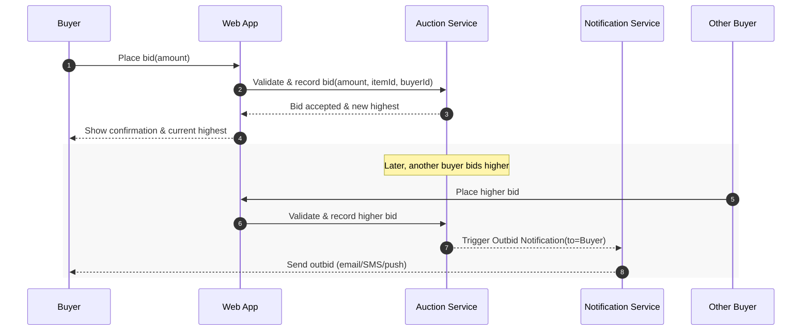
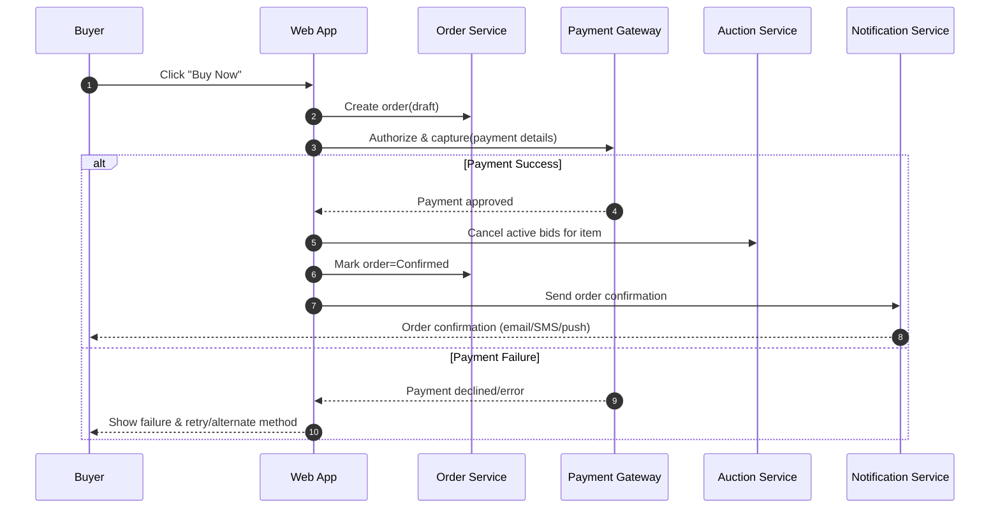
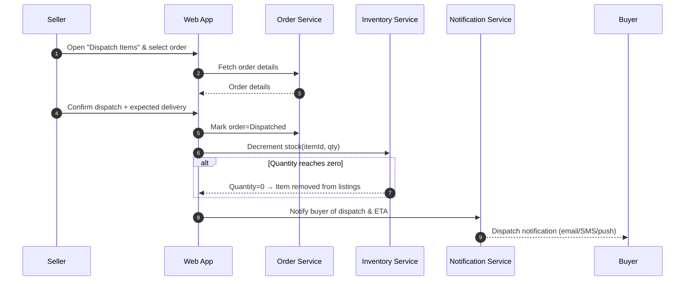
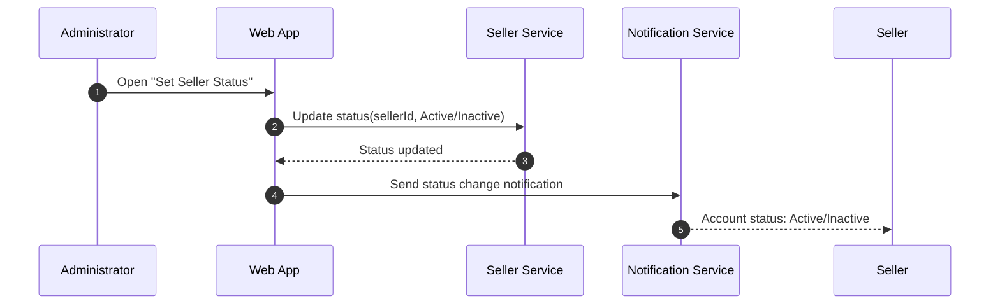
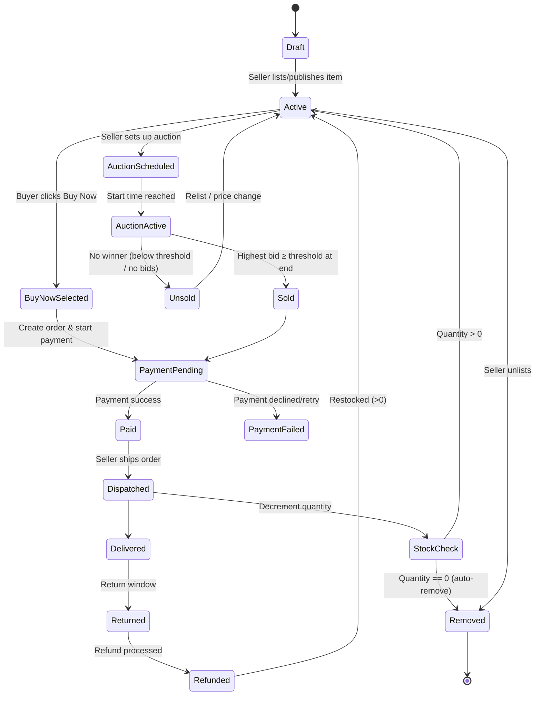
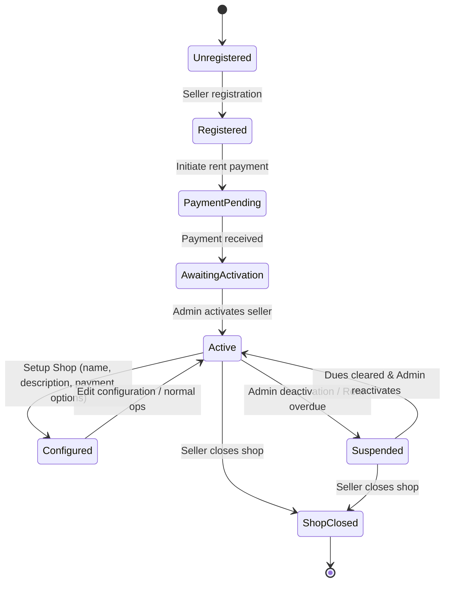
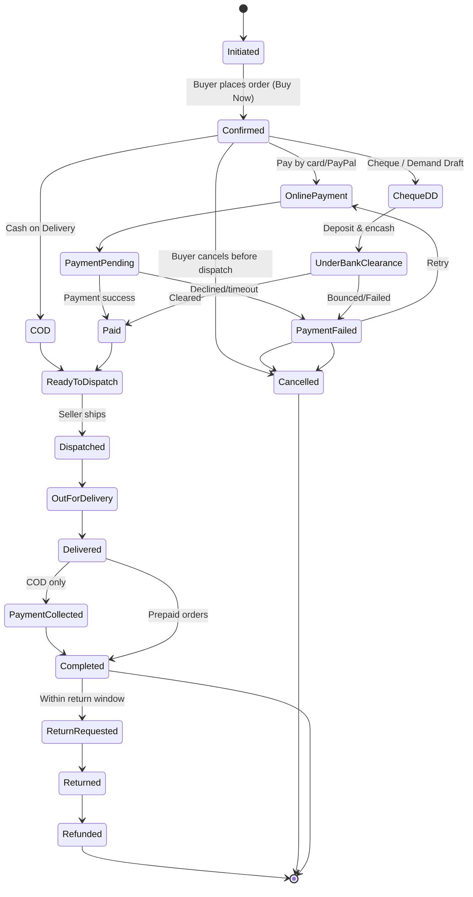

# Ecommerce Web Application — Use Case Specifications (Full)

**Role:** Software Architect  
**Source:** Business Requirements Document (BRD)  
**Generated on:** 11 Feb 2026

> This document derives **use cases** from the BRD’s **Functional Requirements** (FR 6.1–6.5) and presents actors, a Mermaid use‑case diagram, an index mapped to FRs, and **full specifications** (preconditions, triggers, main/alternate flows, postconditions, notifications, and rules). citeturn6search1

---

## 1. Actors

- **Guest (Unauthenticated User):** Browses homepage, views categories & item details, searches items/sellers; must log in to bid or buy. citeturn6search1
- **Buyer:** Registered user who can place bids, buy now, compare prices, manage watchlist, view current bids and past transactions. citeturn6search1
- **Seller:** Registered user (admin‑activated after rent payment) who sets up a shop, lists items, configures auctions, dispatches items, updates stock, reviews transactions, and pays platform rent. citeturn6search1
- **Administrator:** Internal user who activates/deactivates sellers, reviews transactions, and monitors rent defaulters. citeturn6search1
- **Payment Gateway (External System):** Processes online payments (e.g., credit card, PayPal). citeturn6search1
- **Notification Service (External System):** Sends Email/SMS/Push notifications for key events (registration, bids, purchases, dispatch). citeturn6search1

---

## 2. Use‑Case Diagram (Mermaid)

```mermaid
flowchart TB

  %% Actors
  Guest([Guest])
  Buyer([Buyer])
  Seller([Seller])
  Admin([Administrator])
  PG[[Payment Gateway]]
  NS[[Notification Service]]

  %% Use Cases
  UC1[(UC1 Browse & Discover Catalog)]
  UC2[(UC2 Search Items/Sellers)]
  UC3[(UC3 View Item Details)]
  UC4[(UC4 Register Account)]
  UC5[(UC5 Login / Password Reset)]
  UC6[(UC6 Place Bid)]
  UC7[(UC7 Buy Now)]
  UC8[(UC8 Compare Prices)]
  UC9[(UC9 Manage Watchlist)]
  UC10[(UC10 View Current Bids)]
  UC11[(UC11 View Past Transactions)]
  UC12[(UC12 Setup Shop)]
  UC13[(UC13 Add/Edit Item)]
  UC14[(UC14 Setup Auction)]
  UC15[(UC15 View Sale Status)]
  UC16[(UC16 Dispatch Items)]
  UC17[(UC17 Update Stock)]
  UC18[(UC18 Pay Platform Rent)]
  UC19[(UC19 Activate/Deactivate Seller)]
  UC20[(UC20 View Transaction History)]
  UC21[(UC21 View Rent Defaulters)]

  %% Associations
  Guest --> UC1
  Guest --> UC2
  Guest --> UC3
  Guest --> UC4

  Buyer --> UC5
  Buyer --> UC6
  Buyer --> UC7
  Buyer --> UC8
  Buyer --> UC9
  Buyer --> UC10
  Buyer --> UC11

  Seller --> UC12
  Seller --> UC13
  Seller --> UC14
  Seller --> UC15
  Seller --> UC16
  Seller --> UC17
  Seller --> UC18

  Admin --> UC19
  Admin --> UC20
  Admin --> UC21

  %% System Interactions
  UC7 --> PG
  UC6 --> NS
  UC7 --> NS
  UC16 --> NS
```



> The use‑case set reflects FR 6.1 (Discovery), 6.2 (Registration/Login), 6.3 (Buyer), 6.4 (Seller), and 6.5 (Administrator) in the BRD. citeturn6search1

---

## 3. Use‑Case Index (mapped to Functional Requirements)

### FR 6.1 — Discovery & Search
- **UC1 Browse & Discover Catalog**  
- **UC2 Search Items/Sellers**  
- **UC3 View Item Details**  
citeturn6search1

### FR 6.2 — Registration & Authentication
- **UC4 Register Account**  
- **UC5 Login / Password Reset**  
citeturn6search1

### FR 6.3 — Buyer Capabilities
- **UC6 Place Bid**  
- **UC7 Buy Now**  
- **UC8 Compare Prices**  
- **UC9 Manage Watchlist**  
- **UC10 View Current Bids**  
- **UC11 View Past Transactions**  
citeturn6search1

### FR 6.4 — Seller Capabilities
- **UC12 Setup Shop**  
- **UC13 Add/Edit Item**  
- **UC14 Setup Auction**  
- **UC15 View Sale Status**  
- **UC16 Dispatch Items**  
- **UC17 Update Stock**  
- **UC18 Pay Platform Rent**  
citeturn6search1

### FR 6.5 — Administrator Capabilities
- **UC19 Activate/Deactivate Seller**  
- **UC20 View Transaction History**  
- **UC21 View Rent Defaulters**  
citeturn6search1

---

## 4. Detailed Use‑Case Specifications

> The following specifications are implementation‑ready and derived from the BRD. Each UC lists primary/secondary actors, preconditions, triggers, main flow, alternates/exceptions, postconditions, and notes. citeturn6search1

### UC1 — Browse & Discover Catalog
**Goal:** Let users discover items via categories and featured content.  
**Primary Actor:** Guest/Buyer  
**Secondary Actors:** —  
**Preconditions:** Site available; categories configured; top‑selling items computed.  
**Trigger:** User opens homepage.  
**Main Flow:**
1. System displays category listings and images of top 5 selling items.  
2. User selects a category or featured item to open the category listings page.
**Alternate Flows:**
- A1. No featured items → Display categories only.  
- A2. Category empty → Show empty state with search suggestion.  
**Postconditions:** User lands on a category listings (View Items) page.  
**Notes:** Guests can view details but must log in to transact.  
citeturn6search1

**Related states:** [Item: Active](#state-item-active)

### UC2 — Search Items/Sellers
**Goal:** Find items or sellers by keyword and filters.  
**Primary Actor:** Guest/Buyer  
**Preconditions:** Search index/data available.  
**Trigger:** User submits search or opens Advanced Search.  
**Main Flow:**
1. System searches items/sellers by keyword.  
2. User applies filters: category, price, condition (new/used), seller name, seller location, bid format (Auction/Buy Now).  
3. System displays results on View Items page.
**Alternate Flows:**
- A1. No results → Suggest related categories/broader terms.  
**Postconditions:** Results shown or no‑results guidance displayed.  
citeturn6search1

**Related states:** [Item: Active](#state-item-active)

### UC3 — View Item Details
**Goal:** View details to decide whether to bid or buy.  
**Primary Actor:** Guest/Buyer  
**Preconditions:** Item exists in listings.  
**Trigger:** User clicks an item.  
**Main Flow:**
1. System shows image, description, condition, seller & location, shipping cost, current highest bid & bidder, bid start/end (date/time), Buy Now price, and action buttons (Place Bid, Buy the Item).  
2. User decides to bid or buy (login required for transaction).  
**Postconditions:** User proceeds to bid/buy or returns to listings.  
citeturn6search1

**Related states:** [Item: Active](#state-item-active), [Item: AuctionScheduled](#state-item-auctionscheduled), [Item: AuctionActive](#state-item-auctionactive)

### UC4 — Register Account
**Goal:** Allow new users to create Buyer/Seller accounts.  
**Primary Actor:** Guest  
**Preconditions:** None.  
**Trigger:** User selects Buyer or Seller registration.  
**Main Flow:**
1. System captures required fields (first/last name, address1/2, city, state, pincode, telephone, mobile, email, DOB, username, password, secret Q&A).  
2. System confirms account creation via on‑screen message and/or email.  
**Alternate Flows:**
- A1. Seller registers → Account remains inactive until rent is paid and admin activates the account.  
**Postconditions:** Buyer or Seller account created; Seller may be pending activation.  
citeturn6search1

**Related states:** [Shop: Registered](#state-shop-registered)

### UC5 — Login / Password Reset
**Goal:** Authenticate into the system or recover access.  
**Primary Actor:** Buyer/Seller  
**Preconditions:** Account exists.  
**Trigger:** User submits credentials or chooses password reset.  
**Main Flow:**
1. System authenticates user and grants role‑based access.  
2. User lands on role‑appropriate area (Buyer or Seller).  
**Alternate Flows:**
- A1. Forgot password → Reset via email and/or secret Q&A.  
**Postconditions:** User logged in or reset flow completed.  
citeturn6search1

### UC6 — Place Bid
**Goal:** Place a bid on an auction item.  
**Primary Actor:** Buyer  
**Secondary Actors:** Notification Service (alerts)  
**Preconditions:** Buyer logged in; auction active for the item; optional minimum threshold (reserve) set by Seller.  
**Trigger:** Buyer clicks **Place Bid** on item page.  
**Main Flow:**
1. System shows current highest bid and bidder, and accepts bid input.  
2. Buyer enters bid amount and confirms.  
3. System records bid and updates current highest bidder.  
4. At bid end, if highest bid ≥ minimum threshold (if set), system declares winner and prompts for payment.  
**Alternate/Exception Flows:**
- E1. Bid below minimum increment/threshold → Reject with error; allow re‑entry.  
- E2. Auction ends with highest bid < threshold → No winner; item remains unsold.  
**Postconditions:** Bid visible under **My Current Bids**; notifications may be sent (e.g., outbid, winner).  
citeturn6search1


#### Sequence (Mermaid)


**Related states:** [Item: AuctionActive](#state-item-auctionactive), [Item: Sold](#state-item-sold), [Item: Unsold](#state-item-unsold)

### UC7 — Buy Now
**Goal:** Purchase item instantly, bypassing auction.  
**Primary Actor:** Buyer  
**Secondary Actors:** Payment Gateway, Notification Service  
**Preconditions:** Buyer logged in; item has Buy Now price; stock available.  
**Trigger:** Buyer clicks **Buy the Item**.  
**Main Flow:**
1. System creates an order and invokes Payment Gateway for payment.  
2. On successful payment, system cancels all active bids for the item.  
3. System confirms purchase and sends notifications (email/SMS/push).  
**Alternate/Exception Flows:**
- E1. Payment failure → Retry or choose another method; order remains pending/unpaid.  
**Postconditions:** Order placed; appears under **Past Transactions** after completion.  
citeturn6search1


#### Sequence (Mermaid)


**Related states:** [Item: BuyNowSelected](#state-item-buynowselected), [Item: PaymentPending](#state-item-paymentpending), [Item: Paid](#state-item-paid), [Order: Initiated](#state-order-initiated), [Order: Confirmed](#state-order-confirmed), [Order: PaymentPending](#state-order-paymentpending), [Order: Paid](#state-order-paid), [Order: ReadyToDispatch](#state-order-readytodispatch)

### UC8 — Compare Prices
**Goal:** Compare multiple listings of the same product.  
**Primary Actor:** Buyer  
**Preconditions:** Multiple relevant listings exist.  
**Trigger:** Buyer selects multiple listings and clicks **Compare**.  
**Main Flow:**
1. System displays image, name, description, seller, seller location, buy price, and shipping cost for each selected item.  
2. Buyer chooses a preferred seller and may proceed to **Buy Now**.  
**Postconditions:** Buyer decision aided by comparison.  
citeturn6search1

**Related states:** [Item: Active](#state-item-active)

### UC9 — Manage Watchlist
**Goal:** Track interesting items for easy access.  
**Primary Actor:** Buyer  
**Preconditions:** Buyer logged in.  
**Trigger:** Buyer clicks **Watch this Item**.  
**Main Flow:**
1. System adds the item to **My Watch List** and shows watched items with current highest bid and end time.  
2. Buyer can open any watched item and place a bid.  
**Postconditions:** Items tracked under **My Watch List**.  
citeturn6search1

**Related states:** [Item: Active](#state-item-active), [Item: AuctionActive](#state-item-auctionactive)

### UC10 — View Current Bids
**Goal:** Review and manage ongoing bids.  
**Primary Actor:** Buyer  
**Preconditions:** Buyer has placed at least one active bid.  
**Trigger:** Buyer opens **My Current Bids**.  
**Main Flow:**
1. System lists item image, name, description, seller, current highest bid, buyer’s bid, end date/time, and bid status (Active/Expired).  
2. Buyer renews bid if still active (as per UI rules).  
**Postconditions:** Buyer has visibility into all active bids.  
citeturn6search1

**Related states:** [Item: AuctionActive](#state-item-auctionactive)

### UC11 — View Past Transactions (Buyer)
**Goal:** Review historical purchases and winning bids.  
**Primary Actor:** Buyer  
**Preconditions:** Completed transactions exist.  
**Trigger:** Buyer opens **View Past Transactions**.  
**Main Flow:**
1. System lists item image, name, description, seller, seller location, date of transaction, item cost, and whether Bid/Buy.  
**Postconditions:** Buyer can reference history for records/support.  
citeturn6search1

**Related states:** [Order: Completed](#state-order-completed), [Order: Refunded](#state-order-refunded)

### UC12 — Setup Shop
**Goal:** Enable a seller to configure their storefront.  
**Primary Actor:** Seller  
**Preconditions:** Seller account registered; rent paid; admin has activated the account.  
**Trigger:** Seller opens **Setup a Shop**.  
**Main Flow:**
1. Seller provides shop name and description.  
2. Seller configures acceptable payment options (credit card, cheque, demand draft, COD).  
3. System saves the shop profile; seller can now add items.  
**Postconditions:** Shop is ready for item listings.  
citeturn6search1

**Related states:** [Shop: Active](#state-shop-active), [Shop: Configured](#state-shop-configured)

### UC13 — Add/Edit Item
**Goal:** Create or update items in the shop catalog.  
**Primary Actor:** Seller  
**Preconditions:** Active shop exists.  
**Trigger:** Seller opens **Add/Edit Items to Shop**.  
**Main Flow:**
1. Seller enters/updates item image, name, description, price, category, quantity, minimum threshold price (reserve), shipping cost, and condition.  
2. System saves the item record.  
**Postconditions:** Item appears in the catalog and can be auctioned or bought directly.  
citeturn6search1

**Related states:** [Item: Draft](#state-item-draft), [Item: Active](#state-item-active)

### UC14 — Setup Auction
**Goal:** Configure auction parameters for an item.  
**Primary Actor:** Seller  
**Preconditions:** Item exists in the shop.  
**Trigger:** Seller opens **Setup Bids**.  
**Main Flow:**
1. Seller specifies bid start/end date and time, minimum threshold (reserve), and shipping cost overrides (if needed).  
2. System schedules the auction.  
**Postconditions:** Auction runs for the specified window.  
citeturn6search1

**Related states:** [Item: AuctionScheduled](#state-item-auctionscheduled), [Item: AuctionActive](#state-item-auctionactive)

### UC15 — View Sale Status
**Goal:** Provide at‑a‑glance status of items on sale.  
**Primary Actor:** Seller  
**Preconditions:** Items listed; some may be sold/unsold.  
**Trigger:** Seller opens **View Status of Items on Sale**.  
**Main Flow:**
1. System displays item image, name, description, bid times, bid status (sold/unsold), selling method (bid/buy), selling price, price with shipping, payment status, payment option chosen, buyer name, shipping address, email, mobile.  
**Postconditions:** Seller has operational visibility for fulfillment.  
citeturn6search1

**Related states:** [Item: Sold](#state-item-sold), [Item: Unsold](#state-item-unsold), [Order: Paid](#state-order-paid), [Order: Dispatched](#state-order-dispatched)

### UC16 — Dispatch Items
**Goal:** Record dispatch for paid orders and notify buyer.  
**Primary Actor:** Seller  
**Secondary Actors:** Notification Service  
**Preconditions:** Items were sold and payment received.  
**Trigger:** Seller opens **Dispatch Items**.  
**Main Flow:**
1. System shows order details: item image, name, description, selling price, price with shipping, buyer name, shipping address, buyer email and mobile.  
2. Seller confirms dispatch and enters expected delivery date(s).  
3. System decrements item quantity and notifies buyer.  
**Alternate Flows:**
- A1. Quantity reaches zero after dispatch → System removes item from shop and emails the seller automatically.  
**Postconditions:** Order marked dispatched; inventory updated; buyer informed.  
citeturn6search1


#### Sequence (Mermaid)


**Related states:** [Order: ReadyToDispatch](#state-order-readytodispatch), [Order: Dispatched](#state-order-dispatched), [Order: OutForDelivery](#state-order-outfordelivery), [Order: Delivered](#state-order-delivered), [Item: StockCheck](#state-item-stockcheck), [Item: Removed](#state-item-removed)

### UC17 — Update Stock
**Goal:** Maintain accurate inventory quantities.  
**Primary Actor:** Seller  
**Preconditions:** Item exists in shop.  
**Trigger:** Seller opens **Update Item Stock**.  
**Main Flow:**
1. System displays item details (image, name, description, price, category, quantity, threshold, shipping, condition).  
2. Seller updates quantity (and can edit other details).  
3. If quantity is zero, item is removed from listings and automatic email sent to seller.  
**Postconditions:** Inventory reflects accurate quantities.  
citeturn6search1

**Related states:** [Item: StockCheck](#state-item-stockcheck), [Item: Removed](#state-item-removed)

### UC18 — Pay Platform Rent
**Goal:** Pay rent to enable seller account activation.  
**Primary Actor:** Seller  
**Secondary Actors:** Administrator (activation)  
**Preconditions:** Seller registered; account pending activation.  
**Trigger:** Seller opens **Pay to platform**.  
**Main Flow:**
1. Seller pays monthly/quarterly/yearly rent via accepted options.  
2. Administrator activates account after payment confirmation.  
**Postconditions:** Seller account becomes Active; shop can transact.  
citeturn6search1

**Related states:** [Shop: PaymentPending](#state-shop-paymentpending), [Shop: AwaitingActivation](#state-shop-awaitingactivation)

### UC19 — Activate/Deactivate Seller
**Goal:** Control seller ability to transact.  
**Primary Actor:** Administrator  
**Preconditions:** Seller exists; payment status visible.  
**Trigger:** Admin opens **Set Seller Status**.  
**Main Flow:**
1. System shows seller details (name, address, email, mobile), payment status (Paid/Not paid), and current Active/Inactive status.  
2. Admin activates or deactivates seller.  
**Postconditions:** Seller status updated; seller notified.  
citeturn6search1


#### Sequence (Mermaid)


**Related states:** [Shop: Active](#state-shop-active), [Shop: Suspended](#state-shop-suspended)

### UC20 — View Transaction History (Admin)
**Goal:** Review platform transactions for a date range.  
**Primary Actor:** Administrator  
**Preconditions:** Transactions exist.  
**Trigger:** Admin opens **View Transaction History** and selects dates.  
**Main Flow:**
1. System lists item name/description, seller name, buyer name, seller location, shipping address, item price, and whether Bid/Buy.  
**Postconditions:** Admin has reporting visibility.  
citeturn6search1

**Related states:** [Order: Paid](#state-order-paid), [Order: Completed](#state-order-completed), [Order: Refunded](#state-order-refunded), [Item: Sold](#state-item-sold)

### UC21 — View Rent Defaulters
**Goal:** Identify sellers who defaulted on rent.  
**Primary Actor:** Administrator  
**Preconditions:** Sellers exist with due rent.  
**Trigger:** Admin opens **View Default Rent Payments**.  
**Main Flow:**
1. System lists seller name, address, email, mobile, and rent due date.  
**Postconditions:** Admin can initiate follow‑up.  
citeturn6search1

---

## 5. Traceability Matrix (FR → UC)
- **FR 6.1** → UC1, UC2, UC3  
- **FR 6.2** → UC4, UC5  
- **FR 6.3** → UC6, UC7, UC8, UC9, UC10, UC11  
- **FR 6.4** → UC12, UC13, UC14, UC15, UC16, UC17, UC18  
- **FR 6.5** → UC19, UC20, UC21  
citeturn6search1

---

*End of document.*

---

## 7. State Diagram — Item Lifecycle (Mermaid)

<!-- Item lifecycle anchors -->
<a id="state-item-draft"></a>
<a id="state-item-active"></a>
<a id="state-item-auctionscheduled"></a>
<a id="state-item-auctionactive"></a>
<a id="state-item-sold"></a>
<a id="state-item-unsold"></a>
<a id="state-item-buynowselected"></a>
<a id="state-item-paymentpending"></a>
<a id="state-item-paid"></a>
<a id="state-item-dispatched"></a>
<a id="state-item-delivered"></a>
<a id="state-item-returned"></a>
<a id="state-item-refunded"></a>
<a id="state-item-stockcheck"></a>
<a id="state-item-removed"></a>

> The following state machine reflects how an item moves from creation to sale/dispatch based on the BRD, including auction outcomes, Buy Now purchases, payment, and stock‑based removal. It also captures the rule that quantity auto‑decrements on dispatch and items are removed when quantity reaches zero, and that a Buy Now purchase cancels active bids. citeturn6search1turn1search1



**Notes**  
- **Buy Now** cancels ongoing bids for that item immediately upon purchase. citeturn6search1  
- **Dispatch** auto‑decrements item quantity; when quantity reaches **zero**, the item is **automatically removed** from the shop and the seller is notified. citeturn6search1  
- **Auction outcome:** Winner is declared only if the highest bid meets or exceeds the **minimum threshold (reserve)**; otherwise the item remains unsold. citeturn6search1  
- **Relist path:** Unsold items can be moved back to **Active** for relisting or price changes per seller choice. citeturn6search1

```text
Legend
Draft          : Item created but not yet visible in catalog
Active         : Listed in catalog (available for Buy Now or future auction)
AuctionScheduled: Auction parameters set (start/end, reserve)
AuctionActive  : Auction running
Sold           : Auction win recorded (subject to payment)
BuyNowSelected : Buyer initiated direct purchase flow
PaymentPending : Order created; payment in progress
Paid           : Payment completed successfully
Dispatched     : Seller has shipped the item
Delivered      : Buyer received the item
Returned       : Buyer returned the item (optional per policy)
Refunded       : Refund processed to buyer
StockCheck     : Quantity check after dispatch
Removed        : Unlisted/auto-removed (e.g., quantity=0)
```

---

## 8. State Diagram — Seller Shop Lifecycle (Mermaid)

<!-- Seller shop lifecycle anchors -->
<a id="state-shop-unregistered"></a>
<a id="state-shop-registered"></a>
<a id="state-shop-paymentpending"></a>
<a id="state-shop-awaitingactivation"></a>
<a id="state-shop-active"></a>
<a id="state-shop-configured"></a>
<a id="state-shop-suspended"></a>
<a id="state-shop-shopclosed"></a>

> The following state machine captures the **seller shop/account lifecycle** as described in the BRD: seller registers, pays platform rent, awaits administrator activation, becomes active, may be suspended (e.g., rent default or admin action), and can be re‑activated after dues are cleared; the seller may also choose to permanently close the shop. citeturn6search1turn1search1



**Notes**  
- **Activation path:** Sellers must **pay rent** and have the account **activated by an administrator** before transacting. citeturn6search1  
- **Suspension path:** Administrators can **activate/deactivate** sellers; rent defaults are tracked and can drive suspension until dues are cleared. citeturn6search1  
- **Configuration:** After activation, sellers **setup a shop** (name, description, acceptable payment options) prior to listing items. citeturn6search1

```text
Legend
Unregistered      : Seller not on the platform
Registered        : Account created but rent not paid
PaymentPending    : Rent payment initiated; awaiting confirmation
AwaitingActivation: Payment received; pending admin activation
Active            : Account able to transact
Configured        : Shop profile configured (name, description, payment options)
Suspended         : Temporarily inactive (admin action or rent default)
ShopClosed        : Seller voluntarily closed shop (terminal)
```

---

## 9. State Diagram — Buyer Order Lifecycle (Mermaid)

<!-- Order lifecycle anchors -->
<a id="state-order-initiated"></a>
<a id="state-order-confirmed"></a>
<a id="state-order-onlinepayment"></a>
<a id="state-order-paymentpending"></a>
<a id="state-order-paid"></a>
<a id="state-order-paymentfailed"></a>
<a id="state-order-chequedd"></a>
<a id="state-order-underbankclearance"></a>
<a id="state-order-cod"></a>
<a id="state-order-readytodispatch"></a>
<a id="state-order-dispatched"></a>
<a id="state-order-outfordelivery"></a>
<a id="state-order-delivered"></a>
<a id="state-order-paymentcollected"></a>
<a id="state-order-completed"></a>
<a id="state-order-returnrequested"></a>
<a id="state-order-returned"></a>
<a id="state-order-refunded"></a>
<a id="state-order-cancelled"></a>

> The following state machine models a buyer’s **order lifecycle** across payment methods noted in the BRD—online (card/PayPal), **COD**, and **cheque/demand draft**—including cancellation, dispatch, delivery, and return/refund outcomes. Sellers **dispatch after payment** for online/DD/cheque and, for COD, dispatch occurs prior to payment collection at delivery. citeturn1search1



**Notes**  
- **Payment options:** The BRD specifies **PayPal / Credit Card**, **Demand Draft**, **Cheque**, and **COD** (seller-configurable). citeturn1search1  
- **Dispatch rules:** Sellers **dispatch after payment** for online and DD/cheque (post encashment), while **COD** allows dispatch prior to payment, which is **collected on delivery**. citeturn1search1  
- **Buy Now & bids:** A **Buy Now** purchase cancels ongoing bids for that item. (Captured in UC7; life‑cycle impact is that the order proceeds on the chosen payment path.) citeturn1search1
```
Legend
Initiated       : Order created from Buy Now
Confirmed       : Buyer confirms order and selects payment method
OnlinePayment   : Card/PayPal route
PaymentPending  : Awaiting gateway result
ChequeDD        : Cheque/DD chosen
UnderBankClearance: Encashment in progress
COD             : Cash on Delivery chosen
Paid            : Funds confirmed (online or DD/Cheque cleared)
ReadyToDispatch : Fulfillment authorized
Dispatched      : Shipped by seller
OutForDelivery  : Last-mile stage
Delivered       : Buyer received item
PaymentCollected: COD cash collection at delivery
Completed       : Order closed successfully
ReturnRequested : Buyer initiated return
Returned        : Goods received back
Refunded        : Refund processed to buyer
Cancelled       : Order voided prior to dispatch
```

**Related states:** [Shop: Suspended](#state-shop-suspended)
