# Ecommerce Web Application — Full Architecture (C4 + Security + Compliance)

This consolidated document includes:
- C4 System Context, Container, Component Diagrams
- Sequence Diagrams
- Security Architecture Module
- Compliance Controls

All references to guardrails and RTM/STRIDE are retained conceptually but **citation markers are removed** for readability.

---

## 1. Scope & Assumptions
- MFA required for Admin & Seller; optional for Buyer.
- TLS everywhere; SSE‑KMS at rest; PII masking; immutable audit logs (12+ months) with correlation IDs.
- 99.9% uptime; p95 ≤3s UI, ≤500ms API; Blue/Green, canary, smoke tests.
- Functional rules: bidding min increment = max(5%, ₹10); Buy Now requires successful payment; inventory auto-removes zero stock; low-stock ≤5.

---

## 2. C4 — Level 1: System Context
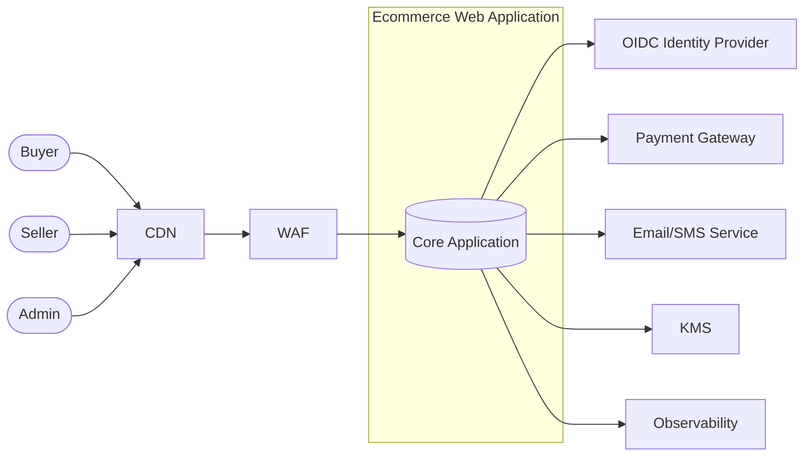

---

## 3. C4 — Level 2: Container View
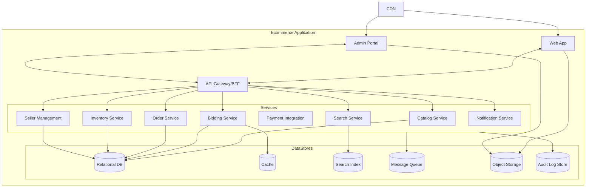

---

## 4. C4 — Level 3: Component Diagrams
### 4.1 Bidding Service
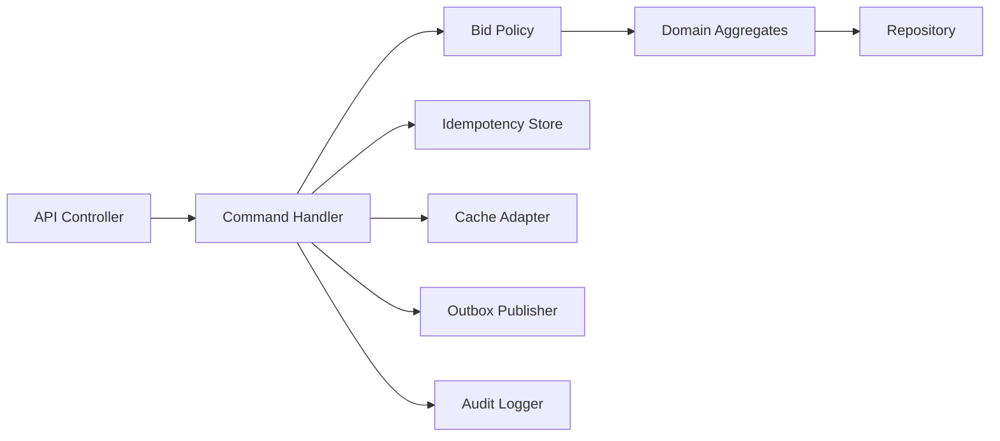

### 4.2 Order Service
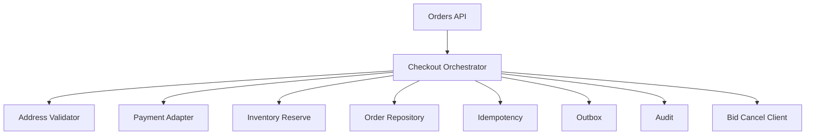

---

## 5. Sequence Diagrams
### 5.1 Place Bid
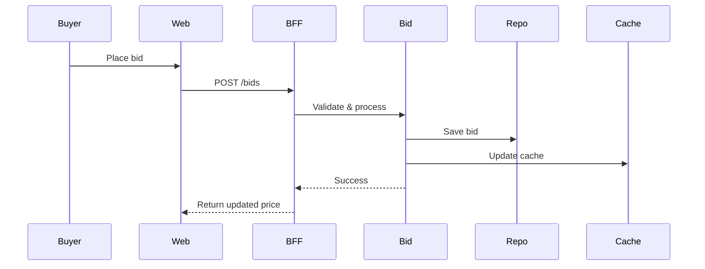

### 5.2 Buy Now + Payment + Bid Cancellation
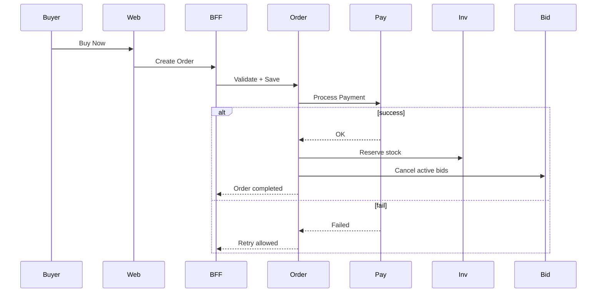

### 5.3 Rent Reminder & Seller Activation
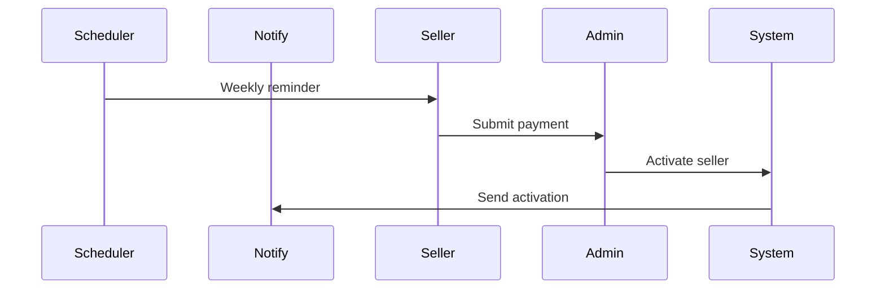

---

## 6. Security Architecture Module
### 6.1 Security Context
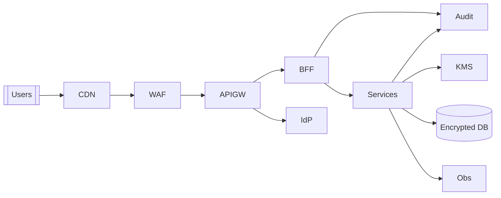

### 6.2 Security Components
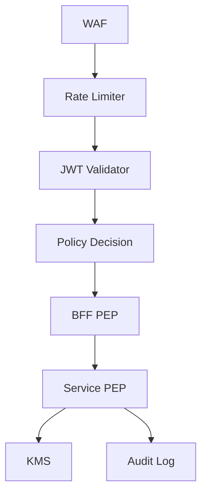

### 6.3 Security Sequences (Login, API Call, Admin Export)
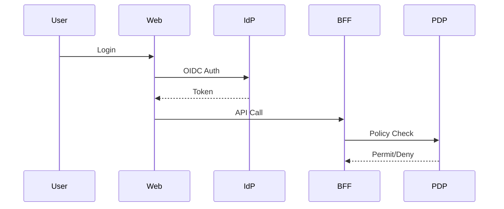

---

## 7. Compliance Controls
- Identity & Access: MFA, lockout, RBAC.
- Data Protection: TLS, SSE‑KMS, PII masking, secrets in KMS.
- Logging & Audit: Immutable logs, no PII in logs, tracing.
- Availability: Probes, failover, blue/green deploys.
- Functional Integrity: Bid increment rule, atomic buy-now.
- Financial & Seller Lifecycle: Rent reminders, payment workflows.
- CI/CD Governance: Contract tests blocking, SoD.

---

## End of Document


# C4 - Component (Level 3): Render-Safe Diagrams

> Render-safe: ASCII only, standard Mermaid shapes, no emojis, no special unicode. All diagrams are fenced with ```mermaid and kept under 120 nodes per graph.

---

## 1) API Gateway / BFF
```mermaid
flowchart TB
  subgraph BFF[API Gateway / BFF]
    Router[Request Router]
    JWT[JWT Validator / JWKS Cache]
    Scope[Scope-Role Enforcement (PEP)]
    Rate[Rate Limiter]
    Agg[UI Aggregators]
    CBreaker[Circuit Breaker]
    Trace[Correlation ID / Tracing]
    Cache[Response Cache]
    Contract[Contract Validation]
  end

  Router --> JWT --> Scope --> Agg
  Router --> Rate
  Agg --> CBreaker
  Agg --> Cache
  Agg --> Trace
  Agg --> Contract
```

## 2) Bidding Service
```mermaid
flowchart LR
  subgraph BidSvc[Bidding Service]
    API[REST API]
    CmdH[Command Handler]
    Rules[Policy Engine (min increment rule)]
    Agg[Aggregates: Auction, Bid]
    Idem[Idempotency Store]
    Repo[Repository]
    Project[Read Model Projector]
    Cache[(Cache)]
    Outbox[Outbox Publisher]
    Audit[Audit Logger]
    Telemetry[Metrics and Tracing]
  end

  API --> CmdH --> Rules --> Agg --> Repo
  CmdH --> Idem
  CmdH --> Project --> Cache
  CmdH --> Outbox
  CmdH --> Audit
  Telemetry --- API
  Telemetry --- CmdH
```

## 3) Order / Checkout Service
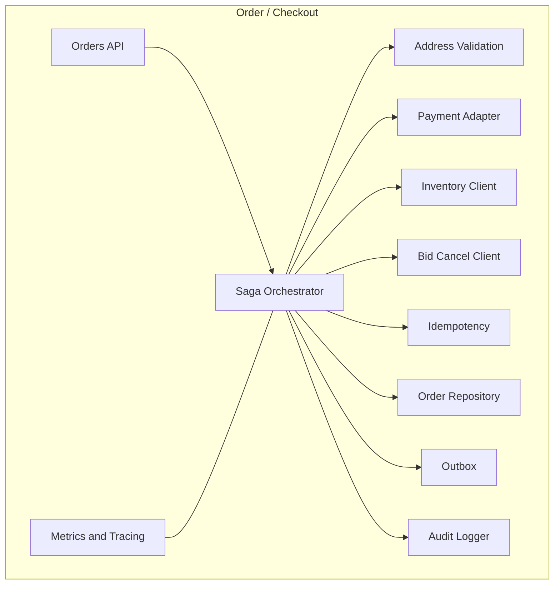

## 4) Catalog Service
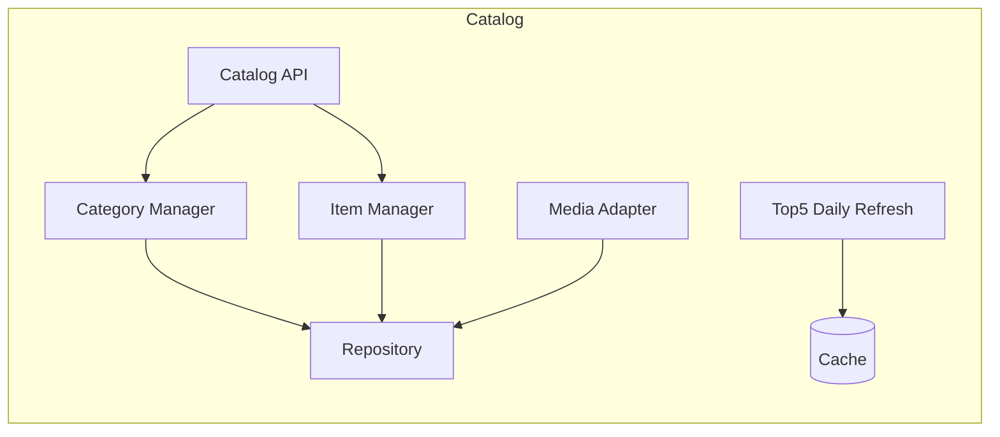

## 5) Search Service
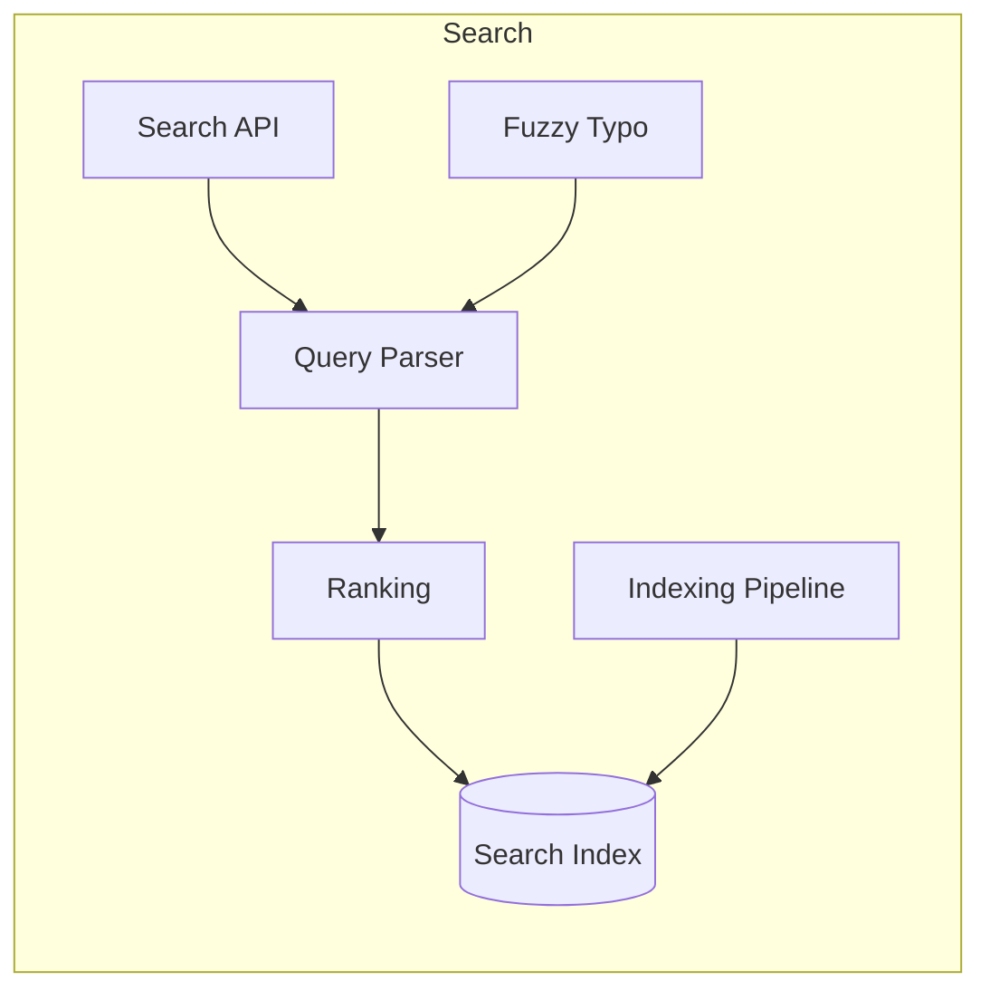

## 6) Inventory Service
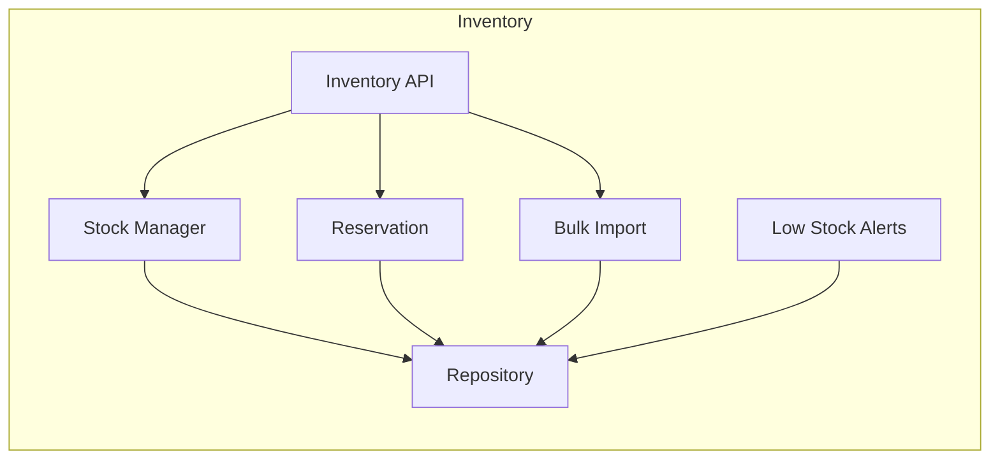

## 7) Seller Management
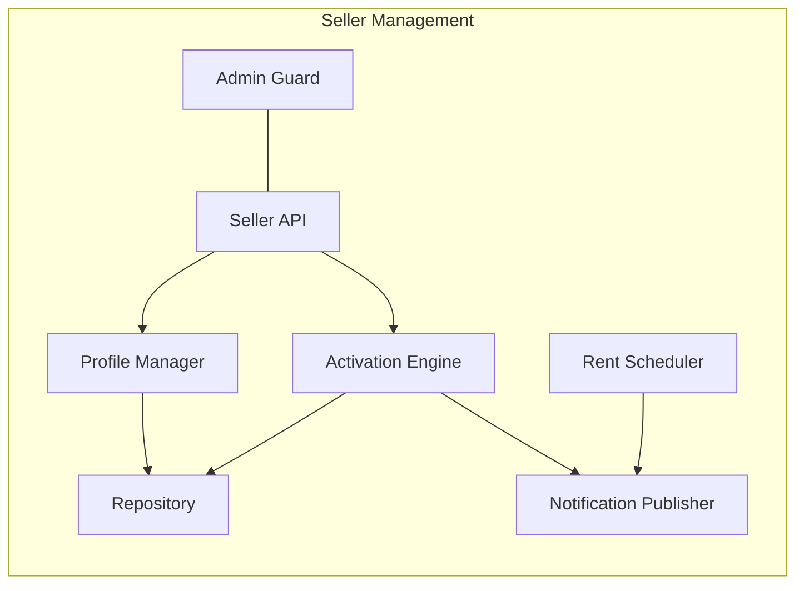

## 8) Payments Integration
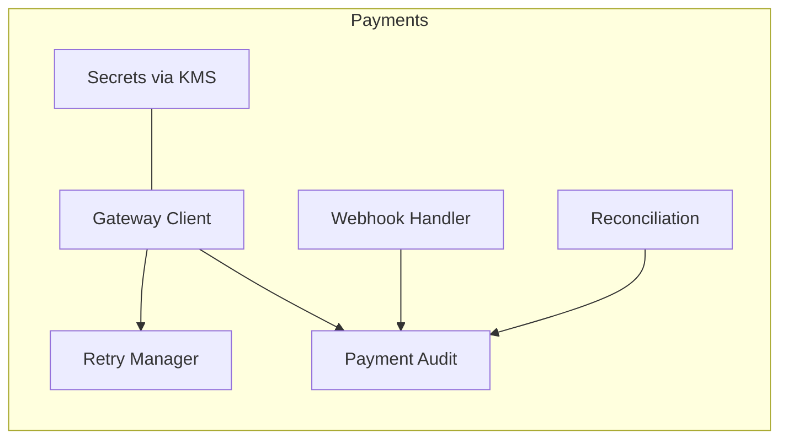

## 9) Notification Service
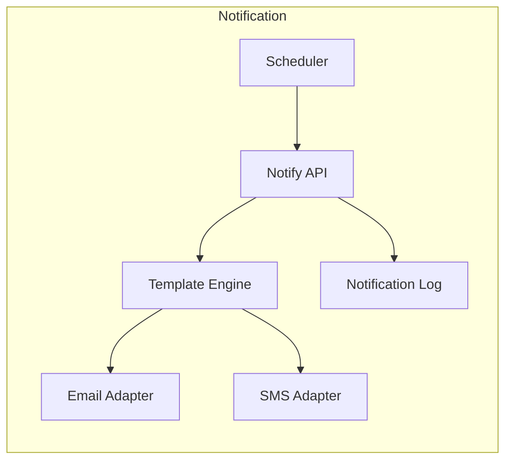


# C4 - Container (Level 2) with Security & Data Flows

> This view expands the Level-2 container model by explicitly showing **security enforcement points**, **identity & secrets**, **audit/observability**, and **key data flows** (browse/search, bid, checkout).

---

## Container Diagram (with Security Overlays)

```mermaid
flowchart TB

%% === EDGE & SECURITY LAYER ===
CDN[CDN / Edge Cache]
WAF[WAF / Bot Mitigation]
APIGW[API Gateway / Security PEP\n- JWT Validation\n- Rate Limiting\n- Scope/Role Enforcement\n- Threat Protection]
IdP[OIDC Identity Provider\n- AuthN\n- MFA]

%% === APPLICATION LAYER ===
subgraph WebTier[Web & Admin Interfaces]
  Web[Web App (Buyer/Seller)]
  AdminUI[Admin Portal]
end

subgraph BFFLayer[Backend for Frontend]
  BFF[BFF Services\n- Session/Token Adapter\n- Aggregation]
end

subgraph Services[Domain Services]
  Catalog[Catalog]
  SearchSvc[Search]
  Bidding[Bidding\n- Min Increment Rule\n- Idempotency]
  Orders[Orders/Checkout\n- Saga / Buy-Now]
  Inventory[Inventory]
  SellerMgmt[Seller Mgmt]
  Payments[Payments Integration]
  Notify[Notification]
end

%% === DATA STORES ===
subgraph Data[Data Layer]
  RelDB[(Relational DB\nSSE-KMS)]
  Cache[(Distributed Cache\nRead Models)]
  SearchIdx[(Search Index)]
  MQ[(Message Queue\nOutbox Events)]
  Obj[(Object Storage\nImages/Exports, SSE-KMS)]
  Audit[(Immutable Audit Log\n>=12m Retention)]
end

%% === SUPPORTING SERVICES ===
KMS[KMS / Secrets]
Obs[Observability\nMetrics/Traces/Alerts]

%% === USERS (FLOW ENTRY) ===
User[[Buyer/Seller/Admin]] --> CDN --> WAF --> APIGW
APIGW --> Web
APIGW --> AdminUI
Web --> BFF
AdminUI --> BFF

%% === CORE SERVICE CALLS ===
BFF --> Catalog --> RelDB
BFF --> SearchSvc --> SearchIdx
BFF --> Bidding --> RelDB
Bidding --> Cache
BFF --> Orders --> RelDB
Orders --> Payments
Orders --> Inventory --> RelDB
BFF --> SellerMgmt --> RelDB
BFF --> Notify

%% === ASYNC + STORAGE ===
Services --> MQ
Web --> Obj
AdminUI --> Obj
Services --> Audit

%% === SECURITY & TELEMETRY ===
APIGW --> IdP
Services --> KMS
Services --> Obs

classDef sec fill:#e8f5e9,stroke:#2e7d32,stroke-width:1px;
classDef data fill:#fff8e1,stroke:#b58900,stroke-width:1px;
classDef app fill:#eaf5ff,stroke:#0366d6,stroke-width:1px;
classDef edge fill:#f5f5f5,stroke:#666,stroke-dasharray:3 3,stroke-width:1px;

class CDN,WAF,APIGW,IdP sec;
class RelDB,Cache,SearchIdx,MQ,Obj,Audit data;
class Web,AdminUI,BFF,Catalog,SearchSvc,Bidding,Orders,Inventory,SellerMgmt,Payments,Notify app;
```

**Notes**
- **PEPs** (policy enforcement points) at API Gateway and BFF; **IdP with MFA** for privileged roles.  
- **KMS/SSE-KMS** protect secrets and data at rest; **immutable audit** for critical events; **observability** carries correlation IDs and SLO-tied alerts.  

---

## Data Flows (Overlays)

### A) Browse/Search (Public GETs via CDN)
```mermaid
flowchart LR
User[[Buyer/Seller]] --> CDN
CDN -- HIT --> User
CDN -- MISS --> APIGW
APIGW --> BFF --> SearchSvc --> SearchIdx
BFF --> Catalog --> RelDB
BFF --> CDN:::edge

classDef edge fill:#f5f5f5,stroke:#666,stroke-dasharray:3 3,stroke-width:1px;
```

**Highlights**
- Static assets and public GETs are cacheable at the **CDN** to reduce origin load and improve p95 latency.  
- **APIGW** validates tokens for personalized calls; public calls enforce basic threat protections.

---

### B) Bid Placement (Integrity + Idempotency)
```mermaid
flowchart LR
User[[Buyer]] --> Web --> BFF --> Bidding
Bidding --> RelDB
Bidding --> Cache
Bidding --> MQ
Bidding --> Audit

classDef data fill:#fff8e1,stroke:#b58900,stroke-width:1px;
class RelDB,Cache,MQ,Audit data;
```

**Highlights**
- **Server-side min-increment rule** and **idempotent writes** ensure integrity.  
- **Outbox events** via **MQ** and **cache refresh** maintain consistency of read models.  
- **Audit** records each accepted/rejected bid for non-repudiation.

---

### C) Checkout / Buy-Now (Atomic Bid Cancellation)
```mermaid
flowchart LR
User[[Buyer]] --> Web --> BFF --> Orders
Orders --> Payments
Orders --> Inventory --> RelDB
Orders --> Bidding
Orders --> Audit
Orders --> MQ

classDef data fill:#fff8e1,stroke:#b58900,stroke-width:1px;
class RelDB,MQ,Audit data;
```

**Highlights**
- **Order** finalizes only after **successful payment**; then issues **bid-cancel** to the Bidding service.  
- **Inventory** reserved/decremented transactionally; **audit** and **outbox** capture the full lifecycle.  

---

## Legend
- **Edge/Security**: CDN, WAF, API Gateway (PEP), IdP (MFA).  
- **Application**: Web/Admin UI, BFF, domain services.  
- **Data**: Relational DB (SSE-KMS), Cache, Search Index, Object Storage, Audit, MQ.  
- **Supporting**: KMS (secrets), Observability (metrics/traces/alerts).


# Ecommerce Web Application — Deployment Variants (Same C4 Semantics)

> Purpose: Provide alternative deployment topologies for the *same* logical C4 design (Context → Containers → Components). Each variant maps the same containers (Web, AdminUI, API Gateway/BFF, Catalog, Search, Bidding, Orders, Payments, Inventory, SellerMgmt, Notify, Data Stores) to different runtime platforms. Diagrams use render‑safe Mermaid.

---

## 1. Common C4 Mapping (Logical → Deployable)

- **Web / AdminUI** → web frontends (SPA/SSR) served behind CDN/WAF.
- **API Gateway / BFF** → single entry for UI, security policy enforcement (JWT/scopes), aggregation.
- **Domain Services** → Catalog, Search, Bidding, Orders, Payments, Inventory, SellerMgmt, Notify.
- **Data Stores** → Relational DB, Cache, Search Index, Queue, Object Store, Audit Log.
- **Cross‑cutting** → IdP (OIDC MFA), KMS (secrets), Observability (logs/metrics/traces).

> All variants preserve API contracts, security controls (MFA, TLS, RBAC), idempotency, and audit retention.

---

## 2. Variant A — Monolith + DB on Managed PaaS

**When**: Small team, fast MVP, moderate traffic, low ops overhead.

**How**: Web+Admin+API/BFF+most domain logic as one deployable (monolith) on App PaaS; background jobs via hosted workers; managed RDBMS and cache.

```mermaid
graph TB
  U[Users]-->CDN[CDN]-->WAF[WAF]-->APP[App PaaS Monolith]
  APP-->DB[(Managed RDBMS)]
  APP-->Cache[(Managed Cache)]
  APP-->Idx[(Search Index)]
  APP-->Q[(Queue)]
  APP-->Obj[(Object Store)]
  APP-->Audit[(Audit Store)]
  APP-->IdP[IdP]
  APP-->KMS[KMS]
  APP-->Obs[Observability]
```

**Pros**
- Simple deployment and operations.
- Lowest cost to start; quick iteration.

**Cons**
- Limited isolation under load; scaling is coarse.
- Harder to evolve domain services independently.

**Notes**
- Keep bid placement and order flows idempotent inside the monolith.
- Use read‑through cache for hot catalog/search.

---

## 3. Variant B — Microservices on Kubernetes

**When**: Need strong isolation, independent scaling, clear domain boundaries.

**How**: Each domain service is its own deployment; ingress routes from CDN/WAF to API Gateway/BFF; state in managed data stores; jobs via CronJobs/Queues.

```mermaid
graph TB
  U[Users]-->CDN[CDN]-->WAF[WAF]-->ING[Ingress]
  ING-->BFF[BFF]
  BFF-->CAT[Catalog]
  BFF-->SEA[Search]
  BFF-->BID[Bidding]
  BFF-->ORD[Orders]
  BFF-->INV[Inventory]
  BFF-->SEL[SellerMgmt]
  BFF-->PAY[Payments]
  BFF-->NOT[Notify]
  CAT-->DB[(Relational DB)]
  SEA-->IDX[(Search Index)]
  BID-->DB
  BID-->CAC[(Cache)]
  ORD-->DB
  INV-->DB
  SEL-->DB
  NOT-->Q[(Queue)]
  ALL[All Services]-->OBJ[(Object Store)]
  ALL-->AUD[(Audit Store)]
  BFF-->IDP[IdP]
  ALL-->KMS[KMS]
  ALL-->OBS[Observability]
```

**Pros**
- Independent scaling and release cadence.
- Fault isolation and clearer ownership.

**Cons**
- Higher operational complexity (clusters, ingress, service mesh optional).
- Distributed transaction management.

**Notes**
- Keep critical flows (bidding/checkout) strongly consistent via ACID + outbox; use retries with backoff.

---

## 4. Variant C — Serverless (API Gateway + Functions)

**When**: Spiky/seasonal traffic, pay‑per‑use desire, minimal ops.

**How**: API Gateway routes to Functions for BFF and services. Use managed DB, cache, queue, and object storage. Long‑running tasks via queues and function triggers.

```mermaid
graph TB
  U[Users]-->CDN[CDN]-->WAF[WAF]-->APIGW[API Gateway]
  APIGW-->BFF[BFF Function]
  BFF-->F_CAT[Catalog Fn]
  BFF-->F_SEA[Search Fn]
  BFF-->F_BID[Bidding Fn]
  BFF-->F_ORD[Orders Fn]
  BFF-->F_INV[Inventory Fn]
  BFF-->F_SEL[SellerMgmt Fn]
  BFF-->F_PAY[Payments Fn]
  BFF-->F_NOT[Notify Fn]
  F_CAT-->DB[(Serverless DB)]
  F_SEA-->IDX[(Search Index)]
  F_BID-->DB
  F_BID-->CAC[(Cache)]
  F_ORD-->DB
  F_INV-->DB
  F_SEL-->DB
  F_NOT-->Q[(Queue)]
  ANY[Functions]-->OBJ[(Object Store)]
  ANY-->AUD[(Audit Store)]
  APIGW-->IDP[IdP]
  ANY-->KMS[KMS]
  ANY-->OBS[Observability]
```

**Pros**
- Fine‑grained autoscaling to zero; low idle cost.
- Simple horizontal scaling for spikes (flash sales).

**Cons**
- Cold starts; function timeouts; integration limits.
- Local development and observability can be trickier.

**Notes**
- Use function‑level idempotency keys; keep per‑request state small.

---

## 5. Variant D — Multi‑Region Active‑Active (Checkout/Bidding)

**When**: Global users, strict availability/RTO, low latency.

**How**: Global load balancer to two+ regions; state split by workload: bidding/orders in region‑local primaries with replication; read traffic any region. Use sticky routing for write flows.

```mermaid
graph TB
  U[Users]-->GLB[Global LB]-->REG1[Region A] & REG2[Region B]
  REG1-->BFF1[BFF]
  REG2-->BFF2[BFF]
  BFF1-->SVC1[Services]
  BFF2-->SVC2[Services]
  SVC1-->DB1[(DB A Primary)]
  SVC2-->DB2[(DB B Primary)]
  DB1---DB2
  SVC1-->IDX1[(Index A)]
  SVC2-->IDX2[(Index B)]
  SVC1-->Q1[(Queue A)]
  SVC2-->Q2[(Queue B)]
  SVC1-->AUD1[(Audit A)]
  SVC2-->AUD2[(Audit B)]
```

**Pros**
- Regional failover; latency close to users.
- Isolation of blast radius.

**Cons**
- Data consistency design is harder (conflict avoidance).
- Higher cost and operational overhead.

**Notes**
- Constrain cross‑region writes to minimize conflicts; replicate audit asynchronously; keep idempotent handlers.

---

## 6. Variant E — Edge‑Accelerated (Read‑Heavy)

**When**: Large anonymous traffic, catalog/search reads dominate, SEO needs.

**How**: Push static assets and selected API GETs to CDN; use edge compute for token checks and simple personalization; origin handles writes.

```mermaid
graph LR
  U[Users]-->CDN[CDN + Edge]
  CDN-->GETS[Cached GET APIs]
  CDN-->EDGE[Edge Logic]
  EDGE-->APIGW[API Gateway]
  APIGW-->BFF[BFF]
  BFF-->SVC[Write Services]
  SVC-->DB[(DB)]
  SVC-->CAC[(Cache)]
  SVC-->OBJ[(Object Store)]
```

**Pros**
- Lower origin load, faster p95 for reads.
- Gradual edge adoption without changing core.

**Cons**
- Cache invalidation, consistency windows.
- Edge platform lock‑in risk.

**Notes**
- Use cache keys by resource version/ETag; short TTLs for hot SKUs.

---

## 7. Variant F — Private Cloud / On‑Prem (Kubernetes or PaaS)

**When**: Data residency, regulatory controls, or existing DC investments.

**How**: Same microservice split, deployed to private clusters; managed DB appliances; enterprise LB/WAF/IdP; storage via on‑prem object store.

```mermaid
graph TB
  U[Users]-->WAF[Enterprise WAF]-->LB[Load Balancer]-->BFF[BFF]
  BFF-->CAT[Catalog]
  BFF-->SEA[Search]
  BFF-->BID[Bidding]
  BFF-->ORD[Orders]
  BFF-->INV[Inventory]
  BFF-->SEL[SellerMgmt]
  BFF-->PAY[Payments]
  BFF-->NOT[Notify]
  CAT-->DB[(DB Appliance)]
  SEA-->IDX[(Search Cluster)]
  BID-->DB
  BID-->CAC[(Cache Cluster)]
  ORD-->DB
  INV-->DB
  SEL-->DB
  NOT-->MQ[(Queue Bus)]
  ANY[All]-->OBJ[(On‑Prem Object Store)]
  ANY-->AUD[(WORM/Audit Vault)]
  ANY-->IDP[Enterprise IdP]
  ANY-->KMS[KMS/HSM]
  ANY-->OBS[Observability]
```

**Pros**
- Full control over data and network.
- Integrates with enterprise identity and governance.

**Cons**
- Capacity planning and upgrades are your responsibility.
- Slower elasticity vs public cloud.

---

## 8. Choosing a Variant (Quick Guide)

| Criterion | A Monolith PaaS | B K8s Microservices | C Serverless | D Multi‑Region | E Edge‑Accel | F Private |
|---|---|---|---|---|---|---|
| Team & Ops Maturity | Low | Medium‑High | Low‑Medium | High | Medium | High |
| Traffic Pattern | Steady | Mixed | Spiky/seasonal | Global high | Read‑heavy | Steady/regulated |
| Time to Market | Fastest | Moderate | Fast | Slower | Moderate | Slower |
| Cost at Low Load | Low | Medium | Lowest | High | Low‑Medium | High |
| Isolation & Scale | Low | High | Function‑level | Region‑level | Read path | High |

---

## 9. Invariant Controls Across Variants

- **Security**: OIDC MFA for Admin/Seller; JWT validation at gateway; RBAC for admin exports; TLS everywhere; secrets in KMS; PII‑safe logging.
- **Data**: ACID for orders/bids; idempotent writes with retry/backoff; outbox + queue for async.
- **Observability**: Correlation IDs; metrics, logs, traces; SLO‑tied alerts.
- **Compliance**: Immutable audit ≥12 months; accessibility (WCAG AA); exception handling via ADRs.

---

## 10. Migration Paths

- **A → B**: Carve out Bidding/Orders first; keep BFF static; adopt DB per service gradually.
- **B → D**: Add second region; start with active‑passive; evolve to active‑active for writes that can shard.
- **A/B → C**: Move Notify, Search ingestion, and exports to functions; keep stateful services on containers.
- **Add E**: Front the read GETs with CDN and edge logic; introduce cache busting from outbox events.

---

*End of document.*


# Deployment Variant Trade-offs (What You Gain vs What You Pay)

*A decision tool to understand benefits, costs, and impact when choosing a deployment model for the Ecommerce Web Application. These trade-offs align with the C4 containers/components you have already defined and the deployment variants document.*

---

## 1. High-Level Comparison Table

### What You Gain vs What You Pay

| Variant | What You Gain (Pros) | What You Pay (Cons / Costs) |
|---|---|---|
| A. Monolith on Managed PaaS | - Fastest to build and deploy<br>- Low operational burden<br>- Simplest debugging and tracing<br>- Single team ownership<br>- Lowest entry cost | - Coarse scaling (entire app)<br>- Performance noisy neighbors inside monolith<br>- Harder to isolate failures<br>- Harder to adopt domain-driven ownership<br>- Slower long-term delivery as system grows |
| B. Microservices on Kubernetes | - Clear domain boundaries<br>- Independent scaling and deployment<br>- Fault isolation between services<br>- Strong team autonomy<br>- Resilience patterns built-in | - Higher ops complexity (cluster, networking)<br>- More distributed failure modes<br>- Requires service mesh/ingress setup (optional)<br>- Increased DevOps/SRE investment<br>- Harder troubleshooting across services |
| C. Serverless (API Gateway + Functions) | - Pay-per-use efficiency<br>- Auto-scales quickly<br>- Ideal for spiky traffic<br>- Minimal infrastructure management<br>- Easy to deploy small units | - Cold starts may affect p95 latency<br>- Function timeouts govern design<br>- Harder local debugging<br>- Per-request limits (payload/time)<br>- Higher vendor/platform lock-in |
| D. Multi-Region Active-Active | - Highest availability (regional failover)<br>- Global low-latency experiences<br>- Reduces impact of regional outages<br>- Scaling isolated per region<br>- Better disaster resilience | - Complex data consistency strategy<br>- Cross-region replication overhead<br>- Higher infra cost (duplicate regions)<br>- Sticky routing requirements<br>- Complex operational runbooks |
| E. Edge-Accelerated (CDN + Edge Runtime) | - Fast first-byte latency globally<br>- Offloads read traffic from origin<br>- Reduces backend p95/p99<br>- Ideal for catalog/search heavy workloads<br>- Supports SEO and high traffic spikes | - Cache invalidation complexity<br>- Partial security logic duplicated on edge<br>- Debugging edge behavior is harder<br>- Some provider lock-in<br>- Limited compute at edge locations |
| F. Private Cloud / On-Prem | - Full control over data and network<br>- Meets strict regulatory/residency policies<br>- Integrates with enterprise identity/HSM<br>- Predictable network boundaries | - Slowest scalability<br>- Highest upfront cost (hardware/cloud-like infra)<br>- Significant ops and maintenance overhead<br>- Requires internal SRE/IT capabilities<br>- Limited elasticity vs public cloud |

---

## 2. Workload Suitability Matrix

| Workload Category | Best Fit Variant(s) | Why |
|---|---|---|
| Steady traffic, low complexity | A | Monolith is simple, cheap, lowest ops overhead |
| Isolated domain workloads | B | Clear domain boundaries and scaling needs |
| Highly spiky/seasonal workloads | C and E | Serverless auto-scales; Edge caches reads cheaply |
| Global latency-sensitive workloads | D and E | Multi-region writes plus global edge caching |
| Strong regulatory / enterprise control | F | Data residency, HSM, private identity systems |
| Discount-style flash bidding events | B, C, D | Spiky writes plus need for isolation and low-latency control |

---

## 3. Cost vs Flexibility Quadrant (ASCII)

```
High Flexibility |                B (Microservices)
                 |            D (Multi-Region)
                 |
                 |        E (Edge-Accelerated)
                 |
 Low Cost--------+------------------------------- High Cost
                 |
                 |   A (Monolith)
                 |       C (Serverless)
                 |
                 |                 F (Private Cloud)
Low Flexibility  |
```

**Interpretation**
- A and C are the lowest cost to start.
- B and D provide the most flexibility but cost more.
- F is high-control but highest-cost.
- E is the sweet spot for low-latency read workloads.

---

## 4. Operational Complexity vs Team Maturity

| Team Maturity | Recommended Variant | Rationale |
|---|---|---|
| Low (1–3 Engineers) | A | Simplest architecture, minimal ops |
| Growing team (3–10) | B or C | Autonomy across services; serverless reduces ops |
| Mature engineering org | B + D + E | Supports multi-region HA and edge accelerations |
| Enterprise IT | F | Full governance, identity integration, compliance |

---

## 5. Risk Trade-offs (What Gets Riskier vs Safer)

| Risk Area | Variant That Minimizes Risk | Variant That Increases Risk |
|---|---|---|
| Availability | D (Multi-Region) | A, F |
| Cost Overrun | A, C, E | D, F |
| Operational Complexity | A, C | B, D, F |
| Debuggability | A | C, D, E |
| Global latency | D, E | A, F |
| Regulatory compliance | F | C, E |

---

## 6. Migration Impact: Cost to Move Later

| From -> To | Effort Level | Why |
|---|---|---|
| A -> B | Medium-High | Monolith decomposition, DB split, contract boundaries |
| A -> C | Medium | Functions easy but stateful workflows harder |
| B -> C | Medium | Some services convert easily, others require redesign |
| B -> D | High | Cross-region consistency, dual-region infra |
| C -> B | Medium-High | Rehydrating services from functions |
| Any -> E | Low-Medium | CDN/edge overlays mostly additive |
| Any -> F | High | Rebuild infra, identity, storage, ops model |

---

## 7. Summary: One-Sentence Guidance Per Variant

- A — Monolith: Choose if you need speed today and complexity is low.
- B — Microservices: Choose if you need domain autonomy and scaling and you have an engineering team.
- C — Serverless: Choose if workloads spike and you want minimal infrastructure operations.
- D — Multi-Region: Choose if global users or strict uptime SLOs matter.
- E — Edge-Accelerated: Choose if read-path performance is your bottleneck.
- F — Private Cloud: Choose for regulatory or enterprise governance requirements.


