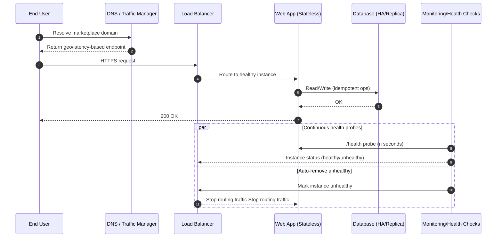
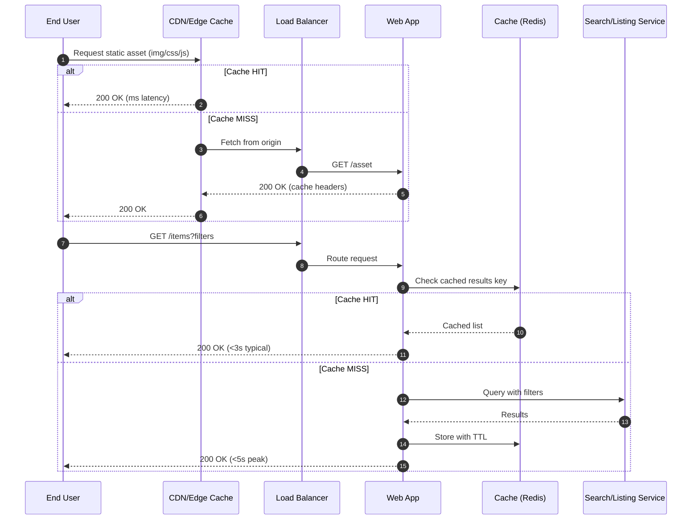
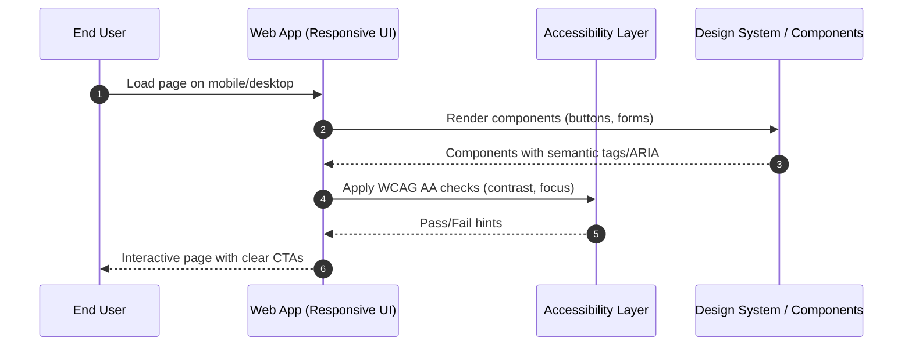
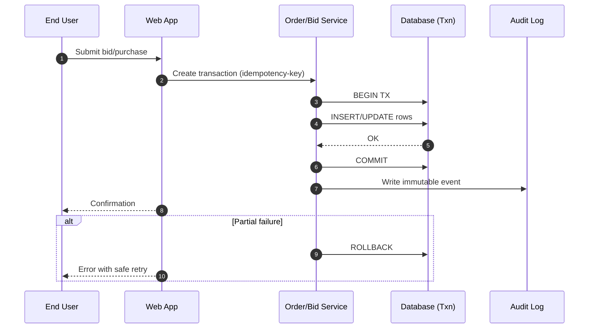
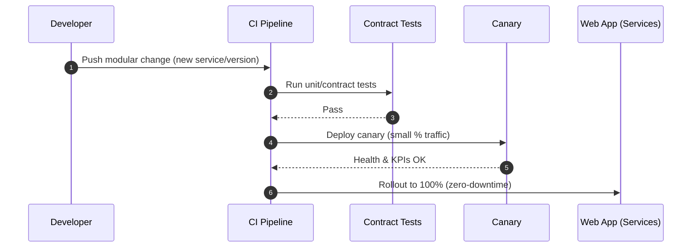
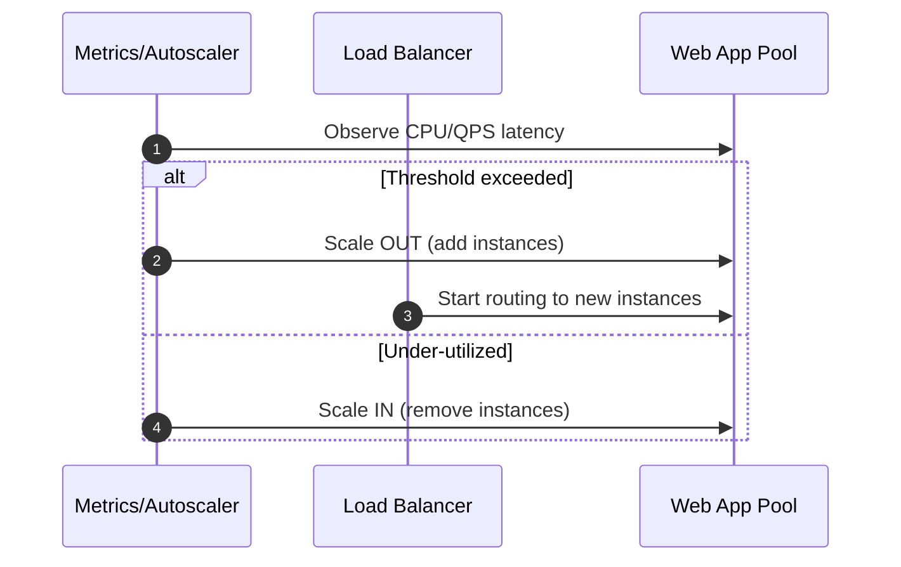
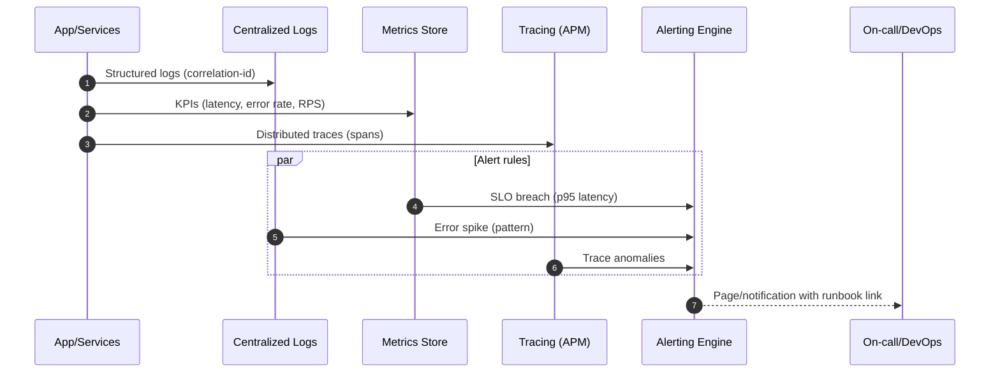

# Ecommerce Web Application — Non‑Functional Requirement (NFR) Use‑Cases

**Role:** Software Architect  
**Source:** BRD — Section "7. Non‑Functional Requirements" (Availability, Performance, Security, Usability, Reliability, Maintainability, Scalability, Observability).   
**Generated on:** 11 Feb 2026

> These use‑cases translate each NFR into verifiable behavior. They define actors, goals, preconditions, main/alternate flows, success metrics, and acceptance criteria that engineering, QA, and DevOps can implement and test against. 

---

## 1. Actors (NFR Context)

- **End User (Buyer/Seller)** — impacted by availability, performance, usability, reliability.   
- **Administrator** — impacted by security and operability of admin functions.   
- **Security Services** — authentication/authorization, encryption, policy enforcement.   
- **Monitoring & Logging** — telemetry, alerting, traceability.   
- **DevOps / Operations** — deployment, scaling, resilience, maintenance.   
- **Platform Services** — CDN, cache, load balancer, database/replicas, object storage, message queues. 

---

## 2. NFR Use‑Case Catalog

### UC‑NFR1 — Ensure 24×7 Availability
**Goal:** Keep the marketplace available at all times with zero planned downtime for core flows.   
**Primary Actors:** End User, DevOps  
**Preconditions:** At least two application instances and HA datastore are provisioned; health probes and failover are configured.  
**Triggers:** User requests any core page/API.

**Main Flow**
1. Request is routed via traffic manager/load balancer to a **healthy** app instance.  
2. Application processes request and reads/writes via a highly available datastore.  
3. Health probes continuously test instances; unhealthy ones are drained automatically.  
4. Blue/green or rolling deployments ensure releases without user‑visible downtime.

**Alternate / Exception Flows**
- **A1. Node Failure:** Instance fails health checks -> LB removes it; traffic continues to remaining nodes.  
- **A2. Primary DB Failure:** Automatic failover to replica; in‑flight transactions retry idempotently.  
- **A3. AZ/Region Degradation (optional):** Traffic manager performs geo/latency failover to secondary region.

**Success Metrics**
- Uptime of **≥ 99.9%** monthly for core endpoints.  
- **Zero** planned downtime for search, item detail, bid, buy, payment.

**Acceptance Criteria**
- Killing one node does not break user sessions.  
- Simulated DB failover does not lose confirmed purchases or successful bids.  
- A deployment does not produce any HTTP 5xx spike beyond the defined error budget.

---


#### Sequence (Mermaid)


### UC‑NFR2 — Meet Performance Targets
**Goal:** Deliver pages within **< 3 seconds** under typical load and **< 5 seconds** under peak; APIs within target p95 latencies.   
**Primary Actor:** End User  
**Preconditions:** CDN, server‑side caching, and pagination are enabled; autoscaling policies defined.  
**Triggers:** User opens homepage/category/search/item or submits checkout.

**Main Flow**
1. Static assets served from CDN; HTML and data endpoints are cached where appropriate.  
2. Server executes queries with indices, uses pagination, and minimizes N+1 calls.  
3. Results returned; browser shows interactive content quickly (lazy‑load non‑critical assets).

**Alternate / Exception Flows**
- **A1. Cache Miss:** Backend generates content, stores it with TTL, returns response within peak target.  
- **A2. High Concurrency:** Autoscaler adds instances; LB redistributes load.  
- **A3. Slow Downstream:** Circuit breaker returns cached/partial data; request degrades gracefully.

**Success Metrics**
- p95 page load **≤ 3s** normal; **≤ 5s** peak.  
- p95 API latency within service SLOs (define per endpoint).  
- Error rate ≤ agreed budget; Core Web Vitals meet thresholds on supported devices.

**Acceptance Criteria**
- Load test at expected peak shows p95 within targets.  
- Cache effectiveness ≥ agreed hit ratio (e.g., 70%+) for eligible endpoints.  
- No synchronous call chains exceed defined hop limits without justification.

---


#### Sequence (Mermaid)


### UC‑NFR3 — Enforce Security Controls
**Goal:** Protect PII and platform assets via strong authn/z, encryption, and audit.   
**Primary Actors:** Security Services, Administrator  
**Preconditions:** Identity provider (OIDC/SAML) configured; TLS enforced; KMS for secrets; RBAC in services; audit sink enabled.

**Main Flow**
1. User authenticates; token validated; roles (buyer/seller/admin) resolved.  
2. All traffic uses TLS; sensitive data encrypted at rest; secrets fetched via KMS (short‑lived).  
3. Requests are authorized per role; least‑privilege data access enforced.  
4. Critical events (login, bid placement, purchase, seller activation, stock change) are appended to immutable audit logs.

**Alternate / Exception Flows**
- **A1. Brute Force / Suspicious Activity:** WAF/rate‑limit triggers; account lockout after threshold.  
- **A2. Unauthorized Access:** Request denied with 403; event logged with correlation ID.  
- **A3. Secret Rotation:** Seamless key rotation without downtime.

**Success Metrics**
- 100% of PII fields encrypted at rest; TLS 1.2+ in transit.  
- 0 critical/high unresolved findings in periodic security scans.  
- Complete audit trail for all specified events with retention as per policy.

**Acceptance Criteria**
- Pen‑test issues remediated; regression tests cover access controls.  
- Secret rotation validated in staging without service interruption.  
- Sampled audit event set reconstructs a bid->buy flow end‑to‑end.

---


#### Sequence (Mermaid)
```mermaid
sequenceDiagram
    autonumber
    participant U as User (Buyer/Seller/Admin)
    participant WAF as Web App Firewall
    participant IDP as Auth Service (OIDC)
    participant WA as Web App
    participant KMS as Key/Secrets Vault
    participant DB as Encrypted DB
    participant AUD as Audit Log

    U->>WAF: HTTPS request with token/credentials
    WAF-->>U: Block if malicious (rule match)
    WAF->>WA: Forward clean traffic

    WA->>IDP: Validate token / authenticate
    IDP-->>WA: Claims (role=buyer/seller/admin)
    WA->>KMS: Fetch DB creds/keys (short‑lived)
    KMS-->>WA: Ephemeral secret
    WA->>DB: Query using TLS; at‑rest encryption
    DB-->>WA: Result
    WA->>AUD: Append audit event (PII‑safe)
    WA-->>U: 200 OK / 401 / 403
```

### UC‑NFR4 — Ensure Usability & Accessibility
**Goal:** Provide an intuitive, accessible UI adhering to **WCAG 2.1 AA**.   
**Primary Actor:** End User  
**Preconditions:** Design system with semantic components; accessibility linting in CI.

**Main Flow**
1. UI renders responsive layouts across breakpoints; keyboard navigation works.  
2. ARIA roles/labels provided; color contrast meets AA; focus states visible.  
3. Forms include clear labels, validation, and error messages; CTAs are unambiguous.

**Alternate / Exception Flows**
- **A1. Assistive Tech:** Screen readers announce controls and dynamic content; skip‑to‑content available.  
- **A2. Low Bandwidth:** Lazy‑load images; provide placeholders; preserve task completion.

**Success Metrics**
- Accessibility automated checks pass; manual audits score AA on key flows.  
- Task success rate and SUS (System Usability Scale) meet targets in UX tests.

**Acceptance Criteria**
- Keyboard‑only path completes registration, bid, and buy flows.  
- Contrast ratios verified; live region announcements for async updates.

---


#### Sequence (Mermaid)


### UC‑NFR5 — Guarantee Reliability & Data Integrity
**Goal:** Ensure accurate, atomic transactions with safe retries and traceability.   
**Primary Actor:** End User  
**Preconditions:** Idempotency keys, ACID transactions, and outbox/event log in place.

**Main Flow**
1. Client submits operation with idempotency key (bid/purchase).  
2. Service executes within a DB transaction; commits on success.  
3. Immutable event recorded (audit/outbox) for reconciliation.

**Alternate / Exception Flows**
- **A1. Partial Failure:** Transaction rolls back; client receives retryable error with guidance.  
- **A2. Duplicate Request:** Idempotency returns original result (no double‑charge).

**Success Metrics**
- 0 lost/duplicated confirmed orders in chaos tests.  
- Reconciliation between order ledger and payments is consistent.

**Acceptance Criteria**
- Simulated network retries do not create duplicate orders.  
- Outbox -> consumer delivery guarantees (at‑least‑once) with idempotent handlers.

---


#### Sequence (Mermaid)


### UC‑NFR6 — Maintainability & Modularity
**Goal:** Enable frequent, low‑risk changes through modular architecture and CI/CD.   
**Primary Actors:** DevOps / Engineering  
**Preconditions:** Service boundaries defined; contract tests and canary deployments available.

**Main Flow**
1. Developer pushes a change; CI runs unit + contract tests.  
2. Canary deploys to a small traffic slice; KPIs monitored.  
3. Progressive rollout to 100% if healthy; instant rollback on regression.

**Alternate / Exception Flows**
- **A1. Backward‑Incompatible Change:** Fails contract tests; build blocked.  
- **A2. Canary Degradation:** Auto‑rollback and alert to on‑call.

**Success Metrics**
- Median lead time and change failure rate within DORA targets.  
- Mean time to restore (MTTR) within defined SLO.

**Acceptance Criteria**
- Two independent services can be deployed without affecting each other's SLAs.  
- Rollback completes within the defined MTTR budget.

---


#### Sequence (Mermaid)


### UC‑NFR7 — Support Scalability
**Goal:** Sustain heavy traffic with predictable cost and performance.   
**Primary Actors:** DevOps / Platform Services  
**Preconditions:** Autoscaling triggers (CPU, p95 latency, queue depth) defined; horizontal scale preferred; DB read replicas configured.

**Main Flow**
1. Metrics exceed thresholds; autoscaler adds instances.  
2. Load balancer includes new instances; cache warms progressively.  
3. Read‑heavy endpoints leverage replicas; write paths remain consistent.

**Alternate / Exception Flows**
- **A1. Traffic Drop:** Autoscaler scales in; stateful processes drain gracefully.  
- **A2. Hot Partition:** Sharding/repartitioning or adaptive caching enabled.

**Success Metrics**
- Target RPS sustained at p95 within performance SLOs.  
- Cost per 1k requests within budget during peak.

**Acceptance Criteria**
- Load tests at 1.2× projected peak pass with no SLO breaches.  
- Scale‑in does not interrupt long‑running requests.

---


#### Sequence (Mermaid)


### UC‑NFR8 — System Observability & Alerting
**Goal:** Make the system measurable and debuggable with proactive alerting.   
**Primary Actors:** Monitoring & Logging, DevOps  
**Preconditions:** Centralized logs, metrics, traces with correlation IDs; SLOs/SLA defined; alert rules configured.

**Main Flow**
1. Services emit structured logs with request/trace IDs.  
2. Metrics (latency, error rate, throughput, saturation) are recorded.  
3. Distributed tracing captures key spans (search, bid, buy, payment, dispatch).  
4. Alerting engine triggers on SLO breaches and error spikes with runbook links.

**Alternate / Exception Flows**
- **A1. Noisy Alerts:** SLO‑aware, multi‑signal rules reduce flapping (time‑windowed aggregation).  
- **A2. Incident:** On‑call receives context (dashboards, last deploy, related traces) to triage quickly.

**Success Metrics**
- p95/99 latencies tracked for all critical endpoints.  
- Mean time to detect (MTTD) and MTTR within targets.

**Acceptance Criteria**
- Injected failure (e.g., DB latency) triggers alerts with a single click path to the trace and recent deploy.  
- Sample of 20 requests show end‑to‑end trace completeness (parent/child spans correct).

---

## 3. NFR Traceability Matrix

| **NFR**            | **Use‑Case ID(s)** |
|--------------------|--------------------|
| Availability       | UC‑NFR1            |
| Performance        | UC‑NFR2            |
| Security           | UC‑NFR3            |
| Usability          | UC‑NFR4            |
| Reliability        | UC‑NFR5            |
| Maintainability    | UC‑NFR6            |
| Scalability        | UC‑NFR7            |
| Observability      | UC‑NFR8            |

---

## 4. How to Validate (Test Ideas)

- **Chaos/Resilience:** Kill pods/instances, failover DB, cut network links -> verify UC‑NFR1/5.   
- **Load/Perf:** Soak and spike tests with real journeys (search->item->buy) -> verify UC‑NFR2/7.   
- **Security:** AuthN/Z regression, secret rotation, WAF rules, pen‑test follow‑ups -> verify UC‑NFR3.   
- **UX/A11y:** Automated axe checks + manual audits on critical flows -> verify UC‑NFR4.   
- **Deployability:** Canary/rollback rehearsals; contract tests gating -> verify UC‑NFR6.   
- **Observability:** Fire drill using synthetic failures to test alerting + runbooks -> verify UC‑NFR8. 

---


#### Sequence (Mermaid)


### End of Document


> **Note:** This is the consolidated NFR use‑case document with embedded Mermaid sequence diagrams under each UC.
